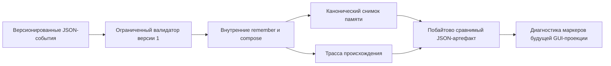

# Воспроизводимое пополнение памяти

Этот минимальный Swift-прототип без окон проигрывает [штатное пополнение памяти FUM](../../Глоссарий/штатное-пополнение-памяти-FUM.md) из версионированного набора входных событий. Он выполняет только две ограниченные внутренние операции, строит канонический снимок памяти и трассу происхождения, а затем печатает единый JSON-артефакт. Одинаковые входные байты дают одинаковые выходные байты; содержательное изменение входа наблюдаемо меняет результат.

Прототип намеренно не содержит GUI, сети, секретов, внешних SwiftPM-зависимостей и реальной LLM. Он проверяет начальную самодостаточную механику, на основе которой следующие версии смогут описывать и исполнять более развитые проекции средствами самой памяти FUM.

## Проверяемый контур



Входной набор содержит `schema_version`, технический `dataset_id` и события с непрерывной последовательностью `sequence`. Интерпретатор принимает не более 256 событий и не более 1 МиБ входа, ограничивает одну производную запись 64 КиБ, а совокупные значения снимка — 4 МиБ. Запись создаётся один раз: повторная цель отклоняется, поэтому результат не зависит от скрытой политики перезаписи.

Поддерживаются только две операции:

- `remember` сохраняет непустое строковое значение под новым ключом;
- `compose` читает перечисленные ранее созданные записи и соединяет их значения заданным разделителем в новую запись.

`compose` не является универсальным языком программирования и не может вызвать команду, открыть файл, обратиться к сети или выполнить текст из памяти. Неподдерживаемая операция, неизвестное или явно `null`-поле, пропуск номера, повторный идентификатор, чтение отсутствующей записи и нарушение лимита завершаются детерминированной типизированной ошибкой без выдачи принятого снимка. Отдельный журнал отклонённых кандидатов ещё не реализован.

## Снимок, трасса и происхождение

Результат содержит отсортированный по ключу `snapshot`, последовательную `trace`, SHA-256 точных входных байтов, отдельные хэши канонического снимка и трассы, а также вычисляемый блок `gui_projection_prerequisites`. Каждый шаг трассы фиксирует входное событие, чтения, запись, хэш канонического события и хэш созданной записи. Каждая запись памяти сохраняет исходный набор, породившее событие, полный упорядоченный список событий-вкладов и идентичность закрытого интерпретатора.

Канонический JSON использует устойчивый порядок ключей и не включает часы, случайные числа, hostname, пользовательские каталоги либо иное машинно-локальное состояние. CLI печатает наружу только типизированные ошибки прототипа, а непредвиденный инфраструктурный отказ сводит к постоянному сообщению без пути машины. Встроенная фикстура показывает переход от минимального безоконного Swift-прототипа и воспроизводимой памяти к описанию следующего этапа, но не выдаёт описание за уже созданную систему.

## Граница GUI

Поле `gui_projection_prerequisites.headless` всегда равно `true`: этот пакет не создаёт и не проверяет графический интерфейс. Отчёт диагностирует только присутствие трёх маркеров и намеренно не называет их готовностью. Для `markers_present` одновременно нужны:

- воспроизводимая память, подтверждённая применённым `remember`;
- ограниченное внутреннее исполнение, подтверждённое применённым `compose`;
- непустая запись `gui-projection-specification`, созданная тем же потоком памяти.

Штатная фикстура намеренно не содержит последнего маркера и получает `markers_missing`. Даже `markers_present` подтверждает лишь присутствие записей с ожидаемыми признаками: он не валидирует спецификацию, не доказывает оператор проекции или причинную связь, а также не означает существование GUI, выбор UI-фреймворка, проверку удобства, безопасность оконного runtime либо жизнеспособность полного FUM.

## Как запустить

Без аргументов точка входа безопасно выполняет встроенный набор `fum.bootstrap.memory.v1` и печатает канонический JSON:

```bash
./Прототипы/воспроизводимое-пополнение-памяти/запустить.sh
```

Явный повтор встроенной фикстуры и справка:

```bash
./Прототипы/воспроизводимое-пополнение-памяти/запустить.sh fixture
./Прототипы/воспроизводимое-пополнение-памяти/запустить.sh --help
```

Собственный набор версии 1 можно явно передать через стандартный ввод:

```bash
printf '%s\n' '<JSON-набор-событий-версии-1>' | \
  ./Прототипы/воспроизводимое-пополнение-памяти/запустить.sh stdin
```

## Проверки

```bash
swift test \
  --package-path Прототипы/воспроизводимое-пополнение-памяти
swift build \
  --package-path Прототипы/воспроизводимое-пополнение-памяти \
  --product FUMMemoryPopulationProbe
swift format lint \
  --configuration Инструменты/fum-kompleksnaya-proverka-repozitoriya/swift-format.json \
  --strict \
  --recursive \
  Прототипы/воспроизводимое-пополнение-памяти/Package.swift \
  Прототипы/воспроизводимое-пополнение-памяти/Sources \
  Прототипы/воспроизводимое-пополнение-памяти/Tests
```

Автономные тесты проверяют побайтовую повторяемость, наблюдаемое изменение снимка после изменения входа, сортировку записей, происхождение результата `compose`, хэши трассы, отказ при неизвестном чтении, запрет повторной цели, непрерывность событий и диагностику маркеров предпосылок GUI-проекции.

## Структура

- `Sources/FUMReproducibleMemoryPopulation/` — типизированный вход, закрытый интерпретатор, канонический кодировщик, снимок, трасса и встроенная фикстура;
- `Sources/FUMMemoryPopulationProbe/` — безопасный запуск фикстуры и ограниченное чтение stdin;
- `Tests/FUMReproducibleMemoryPopulationTests/` — автономная проверка контракта без сети и секретов;
- `Package.swift` — самостоятельный пакет без внешних зависимостей;
- `запустить.sh` — POSIX-точка входа, независимая от текущего каталога.

## Граница применимости

Прототип хранит малый снимок только в памяти процесса и выводит его в stdout. Он не доказывает долговременное хранение, восстановление после сбоя, миграции схем, конкурентную запись, масштабирование, разграничение доступа, качество автоматически найденных структурирующих операторов, агентский цикл или способность FUM самостоятельно синтезировать следующий исполняемый пакет. Фикстура является версионированным инженерным сценарием, а не записью живой модели.

Статус: действующий минимальный безоконный Swift-прототип с воспроизводимым снимком и трассой; GUI отсутствует, а будущая проекция представлена только диагностикой наличия маркеров предпосылок.

## Источники требований

- [исходный запрос текущей рабочей сессии](../../Запросы/2026-07-24_10-44-28_MSK_начать-безоконный-Swift-прототип-воспроизводимого-пополнения-памяти-FUM.md)

## Опорные материалы

- [Модель памяти FUM](../../Документация/01-модель-памяти-FUM.md)
- [Архитектура FUM](../../Документация/22-архитектура-FUM.md)
- [Память структурирующих операторов](../память-структурирующих-операторов/README.md)
- [Чистый модельный шаг](../чистый-модельный-шаг/README.md)

<!-- FUM-MD-RECENCY:BEGIN -->
<!-- last-content-edit: 2026-07-24 16:13:27 MSK -->
<!-- content-sha256: sha256:3899fe3dcb45ee2f9efb135c9e4618d531cfcc0502491fab40bd33acb242e399 -->
<!-- FUM-MD-RECENCY:END -->
