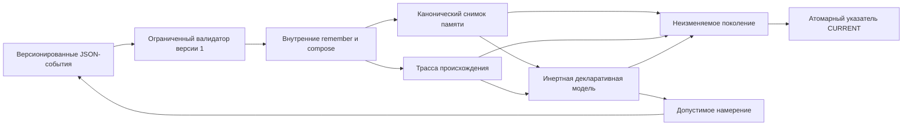

# Воспроизводимое пополнение памяти

Этот минимальный Swift-прототип без окон проигрывает [штатное пополнение памяти FUM](../../Глоссарий/штатное-пополнение-памяти-FUM.md) из версионированного набора входных событий. Он выполняет только две ограниченные внутренние операции, строит канонические снимок памяти, трассу происхождения и инертную декларативную модель представления, а затем может атомарно подтвердить результат как восстанавливаемое поколение. Поколение схемы `2` встраивает явный пустой seed и полный кумулятивный журнал принятых событий, поэтому валидатор заново исполняет `remember` и `compose` без внешней фикстуры. Одинаковые входные байты дают одинаковые выходные байты; содержательное изменение входа наблюдаемо меняет результат.

Прототип намеренно не содержит GUI, renderer, сети, секретов, внешних SwiftPM-зависимостей и реальной LLM. Он проверяет восстановление памяти между процессами и происхождение будущего представления, но не выдаёт сериализуемую модель за жизнеспособный пользовательский интерфейс.

## Проверяемый контур



Входной набор содержит `schema_version`, `policy_version`, технический `dataset_id` и события с непрерывной последовательностью `sequence`. Интерпретатор принимает не более 256 событий во всей цепочке и не более 1 МиБ одного входа, ограничивает одну производную запись 64 КиБ, а совокупные значения снимка — 4 МиБ. Запись создаётся один раз: повторная цель отклоняется, поэтому результат не зависит от скрытой политики перезаписи.

Поддерживаются только две операции:

- `remember` сохраняет непустое строковое значение под новым ключом;
- `compose` читает перечисленные ранее созданные записи и соединяет их значения заданным разделителем в новую запись.

`compose` не является универсальным языком программирования и не может вызвать команду, открыть файл, обратиться к сети или выполнить текст из памяти. Неподдерживаемая операция, неизвестное или явно `null`-поле, пропуск номера, повторный идентификатор, чтение отсутствующей записи и нарушение лимита завершаются детерминированной типизированной ошибкой без выдачи принятого снимка. Отдельный журнал отклонённых кандидатов ещё не реализован.

## Снимок, трасса и происхождение

Результат содержит отсортированный по ключу `snapshot`, последовательную `trace`, `view_model`, SHA-256 точных входных байтов и отдельные хэши трёх канонических представлений, а также совместимый диагностический блок `gui_projection_prerequisites`. Каждый шаг трассы фиксирует идентификатор входного события, чтения, запись, хэш канонического события и хэш созданной записи; полное тело принятого события находится в журнале поколения. Каждая запись памяти сохраняет исходный набор, породившее событие, полный упорядоченный список событий-вкладов и идентичность закрытого интерпретатора.

Канонический JSON использует устойчивый порядок ключей и не включает часы, случайные числа, hostname, пользовательские каталоги либо иное машинно-локальное состояние. CLI печатает наружу только типизированные ошибки прототипа, а непредвиденный инфраструктурный отказ сводит к постоянному сообщению без пути машины. Встроенная фикстура делится на базовый и продолжающий входы, но их объединённый полный replay остаётся самостоятельным эталонным путём, а не готовым снимком памяти.

## Поколения и восстановление

`MemoryGeneration` версии `2` сохраняет версию политики `fum.memory.policy.v1`, SHA-256 канонической программы событий текущего перехода, ссылку на предыдущее поколение, явный версионированный пустой seed и кумулятивную `event_journal`-программу с полными телами всех принятых событий. Валидатор выводит текущую программу как весь журнал начального поколения либо добавленный суффикс продолжения и тем самым связывает `input_sha256` с происхождением. Отдельные SHA-256 seed и журнала, канонические снимок, трасса и модель представления с их хэшами, а также версии интерпретатора и оператора проекции остаются в том же неизменяемом файле. Хэш всего канонического файла становится идентификатором неизменяемого поколения.

`MemoryGenerationStore` сначала проверяет кандидата и текущее подтверждённое состояние, затем атомарно записывает файл `generations/<sha256>.json` и только после этого атомарно заменяет канонический `CURRENT.json`. Сбой до замены `CURRENT`, неверный внутренний хэш, несовместимая версия или неверная ссылка на предыдущее поколение оставляют прежний указатель неизменным. Подготовленный, но не подтверждённый файл может остаться безопасным сиротой: восстановление читает только поколение, на которое указывает успешно проверенный `CURRENT`. Между чтением и заменой указателя нет межпроцессного CAS, поэтому два конкурентных процесса могут оба принять одного родителя и последний молча перезапишет указатель.

Продолжение восстанавливает записи и трассу из подтверждённого поколения, требует тот же `dataset_id`, неизменные префиксы журнала и трассы, а также неизменность ранее подтверждённых записей, продолжает `sequence` и запрещает повторные события и цели. Валидатор проверяет внутренние хэши и происхождение, связывает каждое каноническое событие с шагом трассы, а затем из пустого seed повторно исполняет точную версию политики `remember` и `compose`. Повторно вычисленные снимок, трасса, происхождение записей и модель представления должны точно совпасть с сохранёнными артефактами. Это [воспроизведение принятого эпизода FUM](../../Глоссарий/воспроизведение-принятого-эпизода-FUM.md) не вызывает модель, не обращается к прежнему чату и не зависит от внешней фикстуры.

Накопленный журнал переисполняется типизированным ядром без транспортного лимита одного входа в 1 МиБ; сам журнал по-прежнему ограничен 256 событиями и бюджетами политики. Старая схема поколения `1` не мигрируется молча: хранилище отклоняет её с явной причиной, потому что из одних идентификаторов и хэшей нельзя восстановить утраченные тела событий. Отказ не переписывает файл поколения и `CURRENT`.

## Декларативная модель и граница GUI

Оператор `fum.view-projection.operator.v1` детерминированно выводит по одному текстовому элементу из каждой принятой записи. Элемент хранит ключ источника, породившее событие, весь вклад событий и версию оператора. Валидатор поколения повторно строит модель из снимка и отклоняет поколение, если отдельная доменная истина представления расходится с памятью.

Допустимое намерение `remember` имеет собственную версию схемы и преобразуется в обычную `MemoryPopulationProgram` с версиями схемы и политики, тем же `dataset_id` и следующим номером события. Тестовая фикстура прослеживает происхождение элемента `memory.next-stage` и преобразует намерение `add-user-note` в событие `intent.add-user-note` без подключения GUI.

Поля `view_model.headless` и `gui_projection_prerequisites.headless` всегда равны `true`: пакет не создаёт и не проверяет графический интерфейс. Модель не содержит поля исходного кода и остаётся инертным JSON. Совместимый отчёт предпосылок диагностирует только присутствие трёх маркеров и намеренно не называет их готовностью. Для `markers_present` одновременно нужны:

- воспроизводимая память, подтверждённая применённым `remember`;
- ограниченное внутреннее исполнение, подтверждённое применённым `compose`;
- непустая запись `gui-projection-specification`, созданная тем же потоком памяти.

Штатная фикстура намеренно не содержит последнего маркера и получает `markers_missing`. Даже `markers_present` подтверждает лишь присутствие записей с ожидаемыми признаками: он не означает существование GUI, выбор UI-фреймворка, проверку удобства, безопасность оконного runtime либо жизнеспособность полного FUM. Renderer и исполнение порождённого Swift-кода остаются за [границей открытого вопроса](../../Вопросы/2026-07-24_10-44-28_MSK_граница-GUI-из-внутренних-механизмов-FUM.md).

## Как запустить

Внешняя сессия Codex может выполнить весь безоконный инженерный цикл: вызвать точки входа, передать вход, прочитать исходники и канонический JSON, сопоставить снимки и трассы, проверить коды завершения и запустить тесты. Ручное окно FUM для этого не требуется. Codex остаётся внешним стендом, а не зависимостью Swift-пакета: те же команды доступны обычному неинтерактивному процессу без контекста агентской сессии.

Без аргументов точка входа безопасно выполняет встроенный набор `fum.bootstrap.memory.v1` и печатает канонический JSON:

```bash
./Прототипы/воспроизводимое-пополнение-памяти/запустить.sh
```

Явный повтор встроенной фикстуры и справка:

```bash
./Прототипы/воспроизводимое-пополнение-памяти/запустить.sh fixture
./Прототипы/воспроизводимое-пополнение-памяти/запустить.sh --help
```

Собственный набор версии 1 можно явно передать через стандартный ввод:

```bash
printf '%s\n' '<JSON-набор-событий-версии-1>' | \
  ./Прототипы/воспроизводимое-пополнение-памяти/запустить.sh stdin
```

Восстановление проверяется двумя отдельными процессами над явно выбранным каталогом. `bootstrap` создаёт и подтверждает базовое поколение, `continue` заново читает `CURRENT` и подтверждает продолжение, а `show` проверяет и печатает последнее состояние:

```bash
./Прототипы/воспроизводимое-пополнение-памяти/запустить.sh bootstrap <каталог-поколений>
./Прототипы/воспроизводимое-пополнение-памяти/запустить.sh continue <каталог-поколений>
./Прототипы/воспроизводимое-пополнение-памяти/запустить.sh show <каталог-поколений>
```

Каталог задаётся явно и не должен находиться внутри репозитория, если результат не предназначен для отдельной публикационной проверки.

## Проверки

```bash
swift test \
  --package-path Прототипы/воспроизводимое-пополнение-памяти
swift build \
  --package-path Прототипы/воспроизводимое-пополнение-памяти \
  --product FUMMemoryPopulationProbe
swift format lint \
  --configuration Инструменты/fum-kompleksnaya-proverka-repozitoriya/swift-format.json \
  --strict \
  --recursive \
  Прототипы/воспроизводимое-пополнение-памяти/Package.swift \
  Прототипы/воспроизводимое-пополнение-памяти/Sources \
  Прототипы/воспроизводимое-пополнение-памяти/Tests
```

Автономные тесты дополнительно проверяют канонические тела событий и их связь с трассой, самодостаточный replay начального и продолженного поколений, накопленный журнал больше 1 МиБ, явный немутирующий отказ схемы `1` и две внутренне хэш-согласованные подделки `remember` и `compose`, которые отклоняются только после переисполнения. Побайтовая повторяемость в текущем Swift-runtime, ограничения входа и памяти, логическая атомарность `CURRENT`, наследование, происхождение проекции и обратное событие намерения сохраняют прежнее покрытие.

## Структура

- `Sources/FUMReproducibleMemoryPopulation/` — типизированный вход, закрытый интерпретатор, поколения, файловое хранилище, декларативная проекция, канонический кодировщик и три встроенные фикстуры;
- `Sources/FUMMemoryPopulationProbe/` — безопасный replay, ограниченное чтение stdin и команды `bootstrap`, `continue`, `show`;
- `Tests/FUMReproducibleMemoryPopulationTests/` — автономная проверка контракта без сети и секретов;
- `Package.swift` — самостоятельный пакет без внешних зависимостей;
- `запустить.sh` — POSIX-точка входа, независимая от текущего каталога.

## Граница применимости

Прототип доказывает самодостаточное переисполнение сохранённых принятых событий, логическую атомарность файлового указателя на уровне операции замены и восстановление между штатно завершившимися процессами. За границей остаются журнал отклонённых кандидатов, межпроцессный CAS, process-crash- и power-loss-durability, языконейтральность канонических байтов, чтение или миграция схемы поколения `1`, сборка мусора, масштабирование, разграничение доступа, качество автоматически найденных структурирующих операторов, агентский цикл и способность FUM самостоятельно синтезировать следующий исполняемый пакет. Фикстура является версионированным инженерным сценарием, а не записью живой модели.

Статус: действующий безоконный Swift-прототип с поколениями схемы `2`, полным каноническим журналом принятых событий, самодостаточным replay снимка, трассы, происхождения и инертной декларативной модели представления. Журнал отклонённых кандидатов, CAS, аварийная durability, языконейтральный байтовый профиль, GUI и renderer отсутствуют.

## Источники требований

- [исходный запрос о канонических событиях и самодостаточном replay](../../Запросы/2026-07-27_22-17-40_MSK_сохранить-канонические-события-и-доказать-воспроизведение.md)
- [исходный запрос об интеграции критического анализа](../../Запросы/2026-07-27_20-45-59_MSK_интегрировать-критический-анализ-и-приоритеты-развития-FUM.md)
- [исходный запрос о начальной стадии без GUI с управлением через Codex](../../Запросы/2026-07-27_20-10-35_MSK_разрешить-начальную-коробочную-FUM-без-GUI-через-Codex.md)
- [исходный запрос о восстанавливаемых поколениях и декларативной проекции](../../Запросы/2026-07-25_09-09-06_MSK_добавить-восстанавливаемые-поколения-памяти-и-декларативную-GUI-проекцию.md)
- [исходный запрос о начальном безоконном прототипе](../../Запросы/2026-07-24_10-44-28_MSK_начать-безоконный-Swift-прототип-воспроизводимого-пополнения-памяти-FUM.md)

## Опорные материалы

- [Модель памяти FUM](../../Документация/01-модель-памяти-FUM.md)
- [Архитектура FUM](../../Документация/22-архитектура-FUM.md)
- [Память структурирующих операторов](../память-структурирующих-операторов/README.md)
- [Чистый модельный шаг](../чистый-модельный-шаг/README.md)

<!-- FUM-MD-RECENCY:BEGIN -->
<!-- last-content-edit: 2026-07-27 23:01:25 MSK -->
<!-- content-sha256: sha256:d4a1691be50f285a10a96b78e846ace04a032800595a359d44fa71b0b7812bf4 -->
<!-- FUM-MD-RECENCY:END -->
