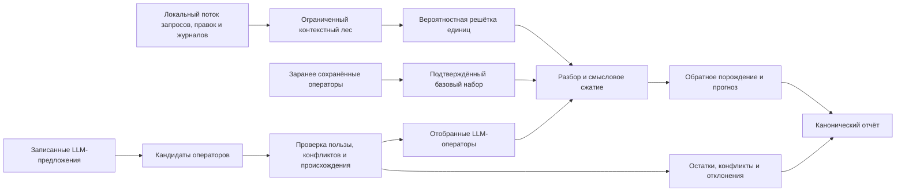

# Память структурирующих операторов

Исходники и тесты теперь находятся в [общем FUMA](../../Приложения/FUMA/README.md). Каталог прототипа сохраняет описание и происхождение. Для сборки обязательно `export SWIFTCI_USE_LOCAL_DEPS=1`.

Этот Swift-прототип проверяет минимальную [память FUM](../../Глоссарий/память-FUM.md), в которой [структурирующие операторы FUM](../../Глоссарий/структурирующий-оператор-FUM.md) одновременно распознают малый локальный поток запросов, правок и журналов, дают компактное описание найденной структуры и участвуют в обратном порождении. Ограниченный контекстный лес сохраняет контексты в пределах заданного бюджета и детерминированно отсекает новые после его исчерпания, вероятностная решётка удерживает конкурирующие единицы разбора, а [система структурирующих операторов FUM](../../Глоссарий/система-структурирующих-операторов-FUM.md) связывает форму, смысл, объяснение и проверяемое действие.

Прототип сопоставляет режим заранее сохранённых операторов с режимом LLM-пополнения. Второй режим использует только детерминированный адаптер записанной фикстуры: он воспроизводит заранее сохранённые предложения модели, не вызывает внешнюю LLM, не обращается к сети и не выдаёт записанный ответ за живое модельное исполнение. Предложения адаптера проходят проверку выигрыша, конфликтов, обратимости и происхождения; заранее сохранённые операторы образуют объявленный фикстурой подтверждённый базовый набор, а отчёт различает происхождение обоих источников.

## Проверяемый контур



[Суффиксно-предиктивная память FUM](../../Глоссарий/суффиксно-предиктивная-память-FUM.md) представлена конечным лесом контекстов переменной длины. Бюджет фикстуры ограничивает глубину и число узлов; после исчерпания бюджета новые контексты детерминированно отсекаются, а лес не растёт неограниченно. Отчёт различает установленный лимит, фактическое использование и отсечённые элементы.

[Самотокенизация FUM](../../Глоссарий/самотокенизация-FUM.md) представлена вероятностной решёткой, где один фрагмент может иметь несколько конкурирующих разборов. Низкоуровневые операторы формы описывают окончания, суффиксы и варианты записи, а более высокие операторы связывают языковые реализации через общий семантический узел. Межъязыковой переход не стирает языково-специфичный остаток и не выдаёт частичное соответствие за полную эквивалентность.

## Операторы, кандидаты и отбор

Память хранит версию оператора, уровень, условия распознавания, правила порождения, положительные и отрицательные примеры, связи с нижними и верхними уровнями, цену хранения, доверие и происхождение. Стратифицированные связи образуют проверяемый граф формы, морфосинтаксиса, семантики, дискурса и исполняемой проекции, а не плоский список правил.

Отчёт разделяет несколько уровней наблюдения:

- сценарные метрики содержат общий выигрыш предсказания, выигрыш сжатия с настроенной стоимостью ссылки, качество обратного порождения, признаки точного и операторного восстановления, объёмы сырого и операторно порождённого входа;
- отчёт каждого операторного кандидата содержит поддержку, собственные выигрыши предсказания и сжатия, качество обратного порождения, источник, конфликты, историю переходов и итоговый статус `hypothesis`, `low_confidence`, `confirmed`, `conflicting`, `rejected` или `obsolete`;
- решётка каждого входного элемента содержит конкурирующие единицы, их нормированные вероятности, сырой вес, способ реконструкции и выбранный путь, но не повторяет сценарные gain-метрики;
- остатки, конфликты и события pruning публикуются отдельными коллекциями; удалённый кандидат получает `obsolete`, а его идентификатор и история отбора остаются в отчёте;
- семантическая связь объяснения может отдельно иметь статус `pending_external_review`.

Ошибочный или неполный вход сначала становится диагностическим остатком. Неспособность текущей памяти разобрать фрагмент сама по себе не создаёт новый полезный оператор: кандидат должен повторно применяться, давать положительный выигрыш и не ухудшать требуемую обратимость. Метрики представлены целочисленными `predictionGainMilliBits`, `compressionGainBits` и `roundTripQualityPPM`; вероятности решётки нормируются в целых миллионных долях. Равные Viterbi-оценки разрешаются числом единиц и устойчивым порядком идентификаторов, поэтому повторный запуск одной фикстуры даёт тот же снимок.

## Режимы источника операторов

В режиме заранее сохранённых операторов разбор использует только версионный набор из фикстуры. В режиме LLM-пополнения тот же набор дополняется предложениями через контракт адаптера. Записанный адаптер читает канонический конверт с идентификатором модели, текстом и хэшем запроса, хэшем канонического массива типизированных предложений и самими предложениями; загрузчик пересчитывает оба хэша и проверяет профили и пространства имён до индексирования. Отчёт явно указывает источник записанной фикстуры и отсутствие внешнего модельного исполнения.

Такой режим проверяет границу интеграции, статусы и отбор LLM-предложений, но не качество неизвестной модели и не доступность внешнего runtime. В сценарии синхронизации один [FUM-узел](../../Глоссарий/FUM-узел.md) помечен как LLM-поддерживаемый агент именно через этот записанный адаптер.

## Проверяемые фикстуры

| Идентификатор фикстуры     | Проверяемый результат                                                                                                                                                                    |
| -------------------------- | ---------------------------------------------------------------------------------------------------------------------------------------------------------------------------------------- |
| `local_stream`             | Запросы, правки, журналы и запись сессии строят ограниченный контекстный лес, альтернативы вероятностной решётки и наблюдаемое pruning.                                                  |
| `bad_input_rejection`      | Опечатка в TeX сохраняется как диагностический остаток; записанный LLM-кандидат ошибочной формы отклоняется и не становится оператором.                                                  |
| `exact_roundtrip`          | Markdown, TeX и Swift-код проходят разбор через заранее сохранённые синтаксические операторы и побайтово восстанавливаются с тем же SHA-256.                                             |
| `semantic_compression`     | Операторы заземляют смысловые факты в байтовых диапазонах планового текста; более короткое описание сохраняет обязательные слоты и происхождение, но не объявляется исходной строкой.    |
| `language_forms`           | Русские окончания, согласование и транслитерация обрабатываются языково-специфичными операторами без переноса поверхностного правила на другой язык.                                     |
| `cross_language_graph`     | Русская и английская конструкции связаны через общий событийный фрейм и страты `form → syntax → semantic`; вид, артикль и неоднозначность местоимений остаются явными остатками.         |
| `explainability_and_links` | Человеческое и ориентированное на LLM представления объяснения, символический оператор, примеры и положительные, отрицательные либо неоднозначные связи соединяются проверяемой трассой. |
| `automation_projection`    | Ограниченный фрагмент [языка автоматизаций FUM](../../Глоссарий/язык-автоматизаций-FUM.md) выводится из операторного графа и исполняется чистым закрытым интерпретатором.                |
| `sync_external_confirmed`  | Человекоподобный и LLM-поддерживаемый узлы с разной локальной памятью проходят полный цикл синхронизации и разрешённое совместное действие.                                              |
| `sync_external_divergence` | Несовместимый пересказ сохраняется как расхождение; ложного подтверждения и совместного действия нет.                                                                                    |
| `sync_internal_subnodes`   | Тот же редьюсер, протокол и типы трассы повторяют полный контур между внутренними подузлами `planner` и `executor`.                                                                      |

Фикстуры совместно покрывают малый поток запросов, правок и журналов. Сохранённые ожидания сценариев и канонический отчёт движка делают наблюдаемыми исходные элементы, применённые версии операторов, предложения адаптера, кандидатов и их статусы, выбранные разборы, остатки, конфликты, pruning, метрики, типы актов синхронизации, ролевые привязки, снимки фактов с их историей и итоговое действие.

## Синхронизация знаний

[Естественно-языковая синхронизация знаний FUM](../../Глоссарий/естественно-языковая-синхронизация-знаний-FUM.md) не копирует операторную память между узлами. Синхронизационный снимок сохраняет для каждого узла его тип, текущие факты и отдельную историю фактов; общая трасса хранит последовательность типов речевых актов, ролевые привязки, расхождения и итог совместного действия. Редьюсер проверяет участников каждого акта по фикстуре. Референты `я`, `ты`, `мы`, `вы` и `они` получают явные ролевые привязки, отделённые от идентичности узла, состава группы, доставки, доступа и полномочий.

Сценарий внешних узлов включает утверждение, вопрос, уточнение, исправление, пересказ и подтверждение. Если подтверждение невозможно, расхождение остаётся явным и не маскируется ложным согласием. Совместное действие появляется только после достаточного для него согласования. Отдельный сценарий передаёт тот же поток между внутренними подузлами и проверяет тот же движок, схему отчёта и правила сохранения расхождения.

## Происхождение и воспроизводимость

Канонический отчёт связывает каждый вывод с идентификаторами входных элементов, операторами и их версиями, режимом источника, записанным предложением LLM-адаптера, результатами метрик, конфликтами и решением отбора. Хэш набора фиксирует канонический логический снимок декодированных фикстур, а хэши входных элементов — их точные байты; ни один из них не доказывает истинность содержащихся утверждений.

Пробник не записывает пользовательские файлы, не обращается к сети, не запускает внешний код и не собирает hostname, пользовательские каталоги или другие машинно-локальные идентификаторы. Вывод является детерминированным JSON-отчётом, пригодным для точного сравнения в автономных тестах.

## Отдельное конечное исполнение

[Контракт конечного исполнения](конечное-исполнение.md) описывает отдельный типизированный вход, закрытые определения, общий исполнитель, строгий UTF-8 → Unicode-скаляры → UTF-32LE/BE, пределы, наблюдения и воспроизводимый профиль. Прежние фикстуры вызывают тот же исполнитель через проверочный адаптер.

## Как запустить

Без аргументов точка входа выполняет весь безопасный набор детерминированных фикстур:

```bash
./Приложения/FUMA/сценарии/запустить-оператор.sh
```

Явный повтор и справка:

```bash
./Приложения/FUMA/сценарии/запустить-оператор.sh --list
./Приложения/FUMA/сценарии/запустить-оператор.sh fixture exact_roundtrip
./Приложения/FUMA/сценарии/запустить-оператор.sh --help
```

## Проверки

```bash
swift test \
  --package-path Приложения/FUMA
swift build \
  --package-path Приложения/FUMA \
  --product FUMStructuringOperatorMemoryProbe
swift format lint \
  --configuration Инструменты/fum-kompleksnaya-proverka-repozitoriya/swift-format.json \
  --strict \
  --recursive \
  Приложения/FUMA/Package.swift \
  Приложения/FUMA/Sources \
  Приложения/FUMA/Tests
```

Автономные тесты подтверждают детерминизм канонического отчёта, лимиты леса, решётки и кандидатов, режимы источника, gain-метрики, качество обратного порождения, статусы и pruning, диагностические остатки, конфликты, языковые уровни, стратифицированные связи, символическую объяснимость, исполняемую проекцию и три сценария синхронизации. Отрицательные проверки отклоняют повреждённый конверт, невалидные хэши и профили, коллизии идентификаторов, висячие графовые и смысловые связи, неподтверждённую автоматизацию, нерелевантное подтверждение и ложноположительный смысловой факт; вероятная ошибка входа не становится оператором.

## Структура

- `Sources/FUMStructuringOperatorMemory/` — неизменяемые контракты, ограниченный контекстный лес, вероятностная решётка, операторная память, разбор, порождение, метрики, отбор, синхронизация и отчёты;
- `Sources/FUMStructuringOperatorMemory/Фикстуры/` — входные сценарии с проверяемыми ожиданиями и повреждённый отрицательный LLM-конверт, упакованные SwiftPM как ресурсы library target;
- `Sources/FUMStructuringOperatorMemoryProbe/` — безопасный запуск полного набора фикстур и справка;
- `Tests/FUMStructuringOperatorMemoryTests/` — автономная приёмка без сети, секретов и внешних зависимостей;
- `Приложения/FUMA/Package.swift` — общий пакет; модуль использует закреплённый Crypto;
- `запустить.sh` — POSIX-точка входа, независимая от текущего каталога.

## Граница применимости

Прототип подтверждает только механику небольшого конечного набора вручную подготовленных потоков и операторов. Его pruning со статусом `obsolete` и сохранением истории кандидата не реализует [управляемое забывание FUM](../../Глоссарий/управляемое-забывание-FUM.md): у прототипа нет поконтурного веса и порога прекращения работы, мета-уровня обнаружения, разделения хранения и работоспособности, [вспоминания FUM](../../Глоссарий/вспоминание-FUM.md), безвозвратного забывания или отбора их темпа. Он также не доказывает качество самотокенизации на произвольных данных, статистическую калибровку вероятностей, универсальность коэффициентов пользы, полноту русского или английского языка, корректность произвольного перевода, безопасность синтезированной программы, долговременную консолидацию памяти или эффективность на большом потоке.

Записанный LLM-адаптер не исполняет модель, не измеряет её вариативность и не подтверждает качество живых предложений. Сценарии синхронизации работают последовательно в одном процессе и не доказывают распределённую согласованность, конкурентность, разграничение доступа или устойчивость к недоверенному узлу. Внутренние подузлы представлены тем же локальным протоколом, но прототип не утверждает их отдельное сознание, самостоятельный runtime или готовый [агентский цикл](../../Глоссарий/агентский-цикл.md).

Связь с языком автоматизаций включает прежнюю исполняемую проекцию и конечные определения над закрытым набором общих операторов. Она не является готовой грамматикой языка, компилятором или разрешением на внешние эффекты. Все численные метрики и пороги принадлежат проверочной фикстуре и не считаются универсальными параметрами FUM.

Статус: ограниченный проверочный Swift-прототип с автономными фикстурами и честной границей записанного LLM-адаптера.

## Источники требований

- [Реализация конечного исполнения и UTF-32](../../Журнал/2026-09-11_07-43-37_MSK_реализовать-интерпретатор-и-UTF-32/запрос.md).

- [исходный запрос 2026-07-31 12:20:47 MSK - Уточнить вспоминание и безвозвратное забывание](../../Журнал/2026-07-31_12-20-47_MSK_уточнить-вспоминание-и-безвозвратное-забывание/запрос.md)
- [исходный запрос 2026-07-31 11:57:37 MSK - Закрепить управляемое забывание FUM](../../Журнал/2026-07-31_11-57-37_MSK_закрепить-управляемое-забывание-FUM/запрос.md)

- [исходный запрос текущей рабочей сессии](../../Журнал/2026-07-24_03-39-33_MSK_подготовить-Swift-прототип-памяти-структурирующих-операторов-FUM/запрос.md)

## Опорные материалы

- [Потоковая самоструктуризация FUM](../../Документация/32-потоковая-самоструктуризация-FUM.md)
- [Система структурирующих операторов FUM](../../Документация/33-система-структурирующих-операторов-FUM.md)
- [Естественный язык и синхронизация знаний FUM](../../Документация/34-естественный-язык-и-синхронизация-знаний-FUM.md)
- [LLM-ориентированный язык автоматизаций](../../Документация/21-LLM-ориентированный-язык-автоматизаций.md)
- [Модель памяти FUM](../../Документация/01-модель-памяти-FUM.md)
- [Архитектура FUM](../../Документация/22-архитектура-FUM.md)
- [открытый вопрос о границах естественно-языковой синхронизации знаний FUM](../../Вопросы/2026-07-13_20-34-23_MSK_границы-естественно-языковой-синхронизации-знаний-FUM.md)

## Генерация нативных моделей

Конечный исполнитель дополнен шагами `разобрать-структурный-контракт` и `породить-представление`. Они исполняются через тот же `AutomationExecutor.выполнить`, сохраняют следы, стоимость и SHA входа. [Рабочий контракт и команды](../../Проекты/рабочий-контекст/операторные-модели-ответа.md) показывают генерацию Swift Codable и Python из одного описания. [Происхождение минимального переноса и приёмка](../../Журнал/2026-09-14_15-54-44_MSK_породить-модели-ответа-операторами/отчёт.md) отделяют исторические свидетельства от текущих 45 тестов.

<!-- FUM-MD-RECENCY:BEGIN -->
<!-- last-content-edit: 2026-09-15 22:25:32 MSK -->
<!-- content-sha256: sha256:6eb71ab3d3be17fa30657e11225823611df215b3b49e4112316ce67106ffab5e -->
<!-- FUM-MD-RECENCY:END -->
