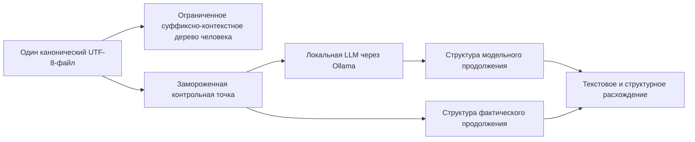

# Теневой редактор продолжений

Этот прототип является первым действующим вертикальным срезом [коробочной реализации FUM](../../Глоссарий/коробочная-реализация-FUM.md) в текущей основной линии репозитория: человек работает с одним большим текстовым файлом, локальная LLM независимо продолжает замороженный префикс, а обе ветви получают одинаковую ограниченную [суффиксно-предиктивную структуру](../../Глоссарий/суффиксно-предиктивная-память-FUM.md). После набора человеческого продолжения редактор раскрывает модельную гипотезу и показывает наблюдаемое расхождение текста и структур.

Прототип не объявляет это расхождение прямым доступом к мысли человека. Он проверяет более узкий и воспроизводимый сигнал: как конкретная локальная модель продолжила доступный ей текст и как тот же префикс фактически продолжил конкретный человек.

## Проверяемый контур



Редактор создаёт контрольную точку после короткой паузы или по кнопке. Она фиксирует версию документа, длину и устойчивый диагностический отпечаток префикса, ограниченное контекстное окно, модель, горизонт и конфигурацию индекса. Прогноз строится в теневом режиме: пока человек не наберёт заданный горизонт, содержимое гипотезы скрыто. Новый ввод имеет приоритет; по мере поступления модельных и человеческих байтов обе производные структуры растут потоково. При достижении горизонта модельный процесс останавливается, и в сравнение попадает столько продолжения, сколько локальная LLM успела породить.

Быстрый индекс реализован как ограниченное дерево точных суффиксных контекстов по UTF-8-байтам. Пути хранятся в обратном порядке, поэтому новый байт обновляет все контексты не глубже заданного предела за `O(maxDepth)`. Бюджет узлов ограничен, а пропущенные расширения отображаются диагностикой. Это минимальный исполняемый baseline, а не полное неограниченное суффиксное дерево и не окончательная форма памяти FUM.

Для сравнения используются длина общего байтового префикса, редакционное расстояние, его нормированное значение, веса общих и раздельных контекстных переходов и взвешенное сходство Жаккара. Вероятностный log-loss не подменяется нулём: текущий CLI-контракт Ollama не предоставляет достаточных вероятностных данных, поэтому эта метрика остаётся следующим расширением.

## Что входит

- macOS-редактор на `NSTextView` для одного UTF-8-файла;
- автоматическое локальное сохранение открытого файла;
- потоковое и бюджетированное суффиксно-контекстное дерево основного текста;
- одна неперекрывающаяся теневая контрольная точка;
- локальный subprocess-контракт Ollama без shell и без передачи текста в аргументах процесса;
- предварительная проверка `ollama show`, не позволяющая `ollama run` автоматически загрузить отсутствующую модель;
- строгая проверка канонического имени модели, чтобы значение не могло стать CLI-флагом, URL или обходом пути;
- принудительный loopback-адрес runtime и отключение истории Ollama для дочерних процессов;
- потоковая нормализация stdout, которая снимает полное эхо префикса и отклоняет пустой вывод, усечённое эхо и справку CLI;
- остановка генерации по горизонту, тайм-ауту, отмене или завершению человеческой ветви;
- одинаковые потоково растущие производные структуры двух продолжений и измеримые метрики;
- выключенная по умолчанию локальная JSONL-трасса рядом с документом и явное удаление файла этой трассы;
- headless-пробник реальной локальной LLM;
- автономные тесты ядра без сети, Ollama и модели.

## Как запустить

Нужны Swift 6 или новее, запущенный локальный Ollama и уже установленная модель. Прототип сам модели не загружает. Простой запуск из корня репозитория:

```bash
ollama serve
ollama list
FUM_LLM_MODEL=<имя-установленной-модели> \
  ./Прототипы/теневой-редактор-продолжений/запустить.sh \
  /путь/к/текстовому-файлу.txt
```

Путь к файлу необязателен: без него откроется пустой редактор, в котором документ можно выбрать или сохранить через интерфейс. Скрипт работает из любого текущего каталога и поддерживает `--help`. Если Ollama находится не в одном из стандартных путей, задаётся публикационно безопасная переменная окружения `FUM_OLLAMA_EXECUTABLE` с локальным путём к исполняемому файлу. Имя модели также можно ввести в поле редактора.

Проверка только модельного адаптера без GUI:

```bash
swift run \
  --package-path Прототипы/теневой-редактор-продолжений \
  FUMShadowProbe \
  --model <имя-установленной-модели> \
  --context "Проверяемый префикс текста" \
  --horizon 128
```

Локальные тесты и сборка:

```bash
swift test --package-path Прототипы/теневой-редактор-продолжений
swift build --package-path Прототипы/теневой-редактор-продолжений --product FUMShadowEditor
swift build --package-path Прототипы/теневой-редактор-продолжений --product FUMShadowProbe
```

## Хранение и приватность

Выбранный текстовый файл остаётся единственным каноническим человеческим документом. Суффиксный индекс пересобираем и не сохраняется. Сохранение завершённых сравнений по умолчанию выключено и включается отдельным переключателем. Тогда рядом с документом создаётся служебная папка `<имя-файла>.fum/` с `comparisons.jsonl`: каталог получает права `0700`, файл - `0600`. Запись содержит метаданные контрольной точки, два коротких продолжения и метрики, но не сохраняет переданное модели контекстное окно. Кнопка удаления удаляет только принадлежащий прототипу `comparisons.jsonl` и оставляет неизвестные файлы служебной папки нетронутыми.

Прототип не перехватывает ввод глобально, не читает другие документы и не содержит облачного fallback. Ollama вызывается только через локальный loopback, а отсутствующая модель не загружается автоматически. Граница доверия остаётся на выбранном локальном исполняемом файле Ollama и его daemon: прототип не доказывает внутреннее устройство подменённого executable. Черновик и короткие продолжения остаются чувствительными локальными данными, поэтому сохранение трассы требует явного opt-in для конкретного запуска.

## Структура пакета

- `Sources/FUMShadowCore/` - суффиксно-контекстное дерево, две ветви, метрики, контрольная точка, локальный процесс и Ollama-адаптер;
- `Sources/FUMShadowEditor/` - macOS-редактор, управление файлом, теневой цикл, инспектор и локальная трасса;
- `Sources/FUMShadowProbe/` - headless-проверка установленной локальной модели;
- `Tests/FUMShadowCoreTests/` - автономные тесты дерева, ветвей, контрольной точки, метрик и subprocess-контракта.

## Проверенный результат

Тесты были сначала добавлены в красном состоянии, затем реализация доведена до их прохождения. Автономный набор из 30 тестов проверяет известные переходы `banana`, эквивалентность потокового и пакетного построения, кириллицу, бюджет узлов, отменяемую пересборку, две растущие структуры продолжения, метрики, неизменяемость и инвалидирование контрольной точки, инкрементальное дописывание, безопасную передачу shell-метасимволов через stdin, строгие имена модели, нормализацию модельного stdout, ограничение вывода и ошибки дочернего процесса.

Помимо mock-независимых тестов выполнен реальный локальный прогон: ранее загруженная модель Qwen3 0.6B в квантовании Q8 была временно подключена к Ollama 0.31.1, чей локальный сервер запустил inference-процесс в offline-режиме на loopback. Ужесточённый `FUMShadowProbe` получил русскоязычное продолжение, а запущенный `FUMShadowEditor` автоматически создал контрольную точку и вызвал тот же локальный модельный контур, не создав выключенную по умолчанию трассу. Временная модель и проверочные файлы после приёмки удалены. Название временного локального манифеста и машинный путь к весам не являются частью воспроизводимого контракта; для повторения подходит любая заранее установленная модель, указанная пользователем.

## Ограничения

- Быстрый путь предполагает дописывание в конец. Правка до контрольной точки инвалидирует её, а произвольное изменение запускает полную фоновую пересборку индекса.
- Точная вставка в конец обновляет индекс без полной UTF-8-копии. Пересборка отменяема и сериализована, но SwiftUI всё ещё передаёт новое значение строки целиком, а автосохранение атомарно переписывает файл; пригодность для действительно больших файлов требует отдельного benchmark.
- Индекс ограничен точными UTF-8-байтами, глубиной и числом узлов. Графемные, токенные, морфологические, смысловые и приближённые представления пока отсутствуют.
- Горизонт сравнения байтовый; последний символ может быть обрезан на границе UTF-8 и отображён с заменяющим знаком, хотя сами байтовые метрики остаются воспроизводимыми.
- Одновременно поддерживается одна контрольная точка, один файл, один пользователь и один Ollama-провайдер.
- Не реализованы logprobs, статистическое сравнение серии сессий, персонализированный обучаемый слой, видимое автодополнение, рандомизация показа, причинная оценка влияния подсказки и дообучение модели.
- Подпись и упаковка `.app`, модельный менеджер, отдельный Linux-интерфейс и промышленный динамический индекс не входят в этот срез.
- Прототип не является всей коробочной FUM, единым приложением локальной памяти или полным агентским циклом. Он проверяет узкий сквозной компонент, который может быть унаследован этими системами.

## Статус

Статус: действующий исследовательский прототип. Ядро, GUI-продукт и headless-пробник собираются; 30 автономных тестов проходят; реальный локальный LLM-вызов и запуск редактора проверены. Для принятия в продуктовый контур нужны benchmark больших файлов, длительные пользовательские прогоны, безопасное завершение несохранённой сессии, версионированная идентичность runtime и модели, вероятностные метрики и решение открытых вопросов о пригодности локальной LLM.

## Источники требований

- [исходный запрос 2026-07-14 08:54:56 MSK - Создать прототип расхождения продолжений](../../Запросы/2026-07-14_08-54-56_MSK_создать-прототип-расхождения-продолжений.md)
- [исходный запрос 2026-07-14 01:40:47 MSK - Сравнить продолжение LLM с набором человека](../../Запросы/2026-07-14_01-40-47_MSK_сравнить-продолжение-LLM-с-набором-человека.md)
- [исходный запрос 2026-07-17 12:20:17 MSK - Создать скрипты запуска прототипов](../../Запросы/2026-07-17_12-20-17_MSK_создать-скрипты-запуска-прототипов.md)

## Опорные материалы

- [Обобщённый поиск повторяющихся последовательностей](../../Документация/08-обобщённый-поиск-повторяющихся-последовательностей.md)
- [Внутренние модели других узлов](../../Документация/10-внутренние-модели-других-узлов.md)
- [Локальный агент FUM на выделенной машине](../../Документация/24-локальный-агент-на-выделенной-машине.md)
- [Интерфейс FUM-узла](../../Документация/25-интерфейс-FUM-узла.md)
- [Потоковая самоструктуризация FUM](../../Документация/32-потоковая-самоструктуризация-FUM.md)
- [Границы естественно-языковой синхронизации знаний FUM](../../Вопросы/2026-07-13_20-34-23_MSK_границы-естественно-языковой-синхронизации-знаний-FUM.md)
- [Критерии локальной LLM и выделенной машины FUM](../../Вопросы/2026-06-25_19-50-33_MSK_критерии-локальной-LLM-и-выделенной-машины-FUM.md)

<!-- FUM-MD-RECENCY:BEGIN -->
<!-- last-content-edit: 2026-07-17 12:26:04 MSK -->
<!-- content-sha256: sha256:28de79ae98b2e0c319ed5082b64e737ac573e4e3d6619462ac3a1a6c573e4dda -->
<!-- FUM-MD-RECENCY:END -->
