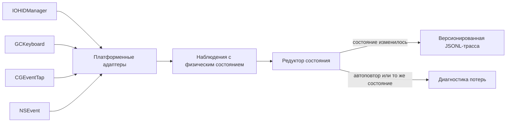

# Физические состояния клавиш

Этот Swift-прототип выбирает стек наблюдения клавиатуры для требования о [физических переходах клавиш](../../Требования/🚧-физические-переходы-клавиш.md) и реализует клавиатурный срез [версионированной первичной трассы событий ввода](../../Требования/🚧-версионированная-первичная-трасса-событий-ввода.md). Результат первого этапа — гибридная архитектура: `IOHIDManager` как первичный macOS-источник, `GCKeyboard` как переносимый слой платформ Apple, а `CGEventTap` и `NSEvent` как диагностические источники для измерения потерь и поведения системного потока.

Первичная трасса содержит только изменения явного физического состояния клавиши. Автоповтор не считается физическим событием: источник с явным признаком повтора отбрасывается сразу, а общий редуктор независимо исключает повтор уже известного состояния.

## Проверяемый контракт



Ключ задаётся пространством кодов, идентификатором устройства, usage page и usage. Для HID-источника это настоящий HID usage; виртуальный код `CGEvent` и `NSEvent` хранится в отдельном пространстве `macVirtualKeyCode` и не выдаётся за HID usage. Состояния `pressed` и `released` не выводятся из символа, раскладки, общего флага модификаторов или логического режима Caps Lock.

Все адаптеры приводят временные метки к единой монотонной шкале наносекунд с момента запуска системы через `MonotonicTimestampNormalizer`. IOHID передаёт тики AbsoluteTime, которые преобразуются с коэффициентом `mach_timebase_info`; `CGEvent` и `GCKeyboard` явно передают уже наносекундные значения, а секунды `NSEvent` проверяются и переводятся в наносекунды. Преобразование IOHID не переполняет промежуточное произведение и отклоняет непредставимый итог вместо аварии или незаметного искажения.

Фильтрация выполняется в два слоя:

1. наблюдение с `isAutoRepeat == true` отклоняется как автоповтор;
2. наблюдение, равное уже известному состоянию той же клавиши того же устройства, отклоняется как неизменившееся состояние;
3. только оставшийся переход получает `schemaVersion`, последовательный номер, предыдущее состояние, новое состояние и монотонное время.

## Выбор стека

| Источник       | Физическое состояние                                                 | Идентичность устройства | Автоповтор                                  | Роль в выбранном стеке                    |
| -------------- | -------------------------------------------------------------------- | ----------------------- | ------------------------------------------- | ----------------------------------------- |
| `IOHIDManager` | значение HID-элемента и HID usage                                    | раздельная              | не нужен; дубликаты отсекает редуктор       | первичный источник клавиатуры на macOS    |
| `GCKeyboard`   | `pressed` в обработчике изменения и `GCKeyCode`                      | объединённая            | отдельного признака нет; состояние меняется | переносимый слой Apple и резерв на macOS  |
| `CGEventTap`   | `keyDown`/`keyUp`; для `flagsChanged` — запрос состояния HID-системы | отсутствует             | есть явное поле                             | системная диагностика и сравнение потерь  |
| `NSEvent`      | `keyDown`/`keyUp`; модификаторы приходят как `flagsChanged`          | отсутствует             | есть `isARepeat`                            | прикладная диагностика, не первичный слой |
| UI Presses     | HID usage и фазы на поддерживаемых UI-платформах                     | отсутствует             | зависит от платформенного контура           | будущий прикладной контрольный источник   |

`IOHIDManager` выигрывает на macOS не из-за заранее заданного веса API, а потому что единственный из реализованных кандидатов одновременно сохраняет HID usage, значение элемента, монотонное время и раздельную идентичность устройств. `GCKeyboard` выигрывает в переносимом срезе благодаря общему публичному API Apple и явному булеву состоянию, но его `coalesced`-модель фиксируется как потеря различимости нескольких клавиатур.

## Состав прототипа

- `FUMInputCore` — переносимая модель ключа, наблюдения, перехода, JSONL-записи, редуктор состояния и воспроизводимая матрица кандидатов;
- `FUMInputMac` — адаптеры `IOHIDManager`, `GCKeyboard`, `CGEventTap` и `NSEvent`, инвентаризация HID-клавиатур и снимок доступности среды;
- `FUMInputProbe` — headless-команды для вывода матрицы, проверки среды, инвентаризации устройств и явно включаемой записи;
- `FUMInputCoreTests` и `FUMInputMacTests` — автономные тесты физического контракта и преобразования платформенных событий.

## Как проверить

Сборка и автономные тесты не требуют сети, секретов, разрешения на запись пользовательского ввода или фактического нажатия клавиш:

```bash
swift test --package-path Прототипы/физические-состояния-клавиш
swift build \
  --package-path Прототипы/физические-состояния-клавиш \
  --product FUMInputProbe
swift format lint --recursive \
  Прототипы/физические-состояния-клавиш/Sources \
  Прототипы/физические-состояния-клавиш/Tests \
  Прототипы/физические-состояния-клавиш/Package.swift
```

Простой запуск без аргументов строит воспроизводимую матрицу и предварительную рекомендацию:

```bash
./Прототипы/физические-состояния-клавиш/запустить.sh
```

Проверка доступности API и публикационно чистая инвентаризация без серийных номеров и локальных путей:

```bash
./Прототипы/физические-состояния-клавиш/запустить.sh environment
./Прототипы/физические-состояния-клавиш/запустить.sh devices
```

Запись запускается только отдельной явной командой. Она ничего не сохраняет сама, а выводит JSONL в stdout; перенаправление в файл является отдельным решением оператора:

```bash
./Прототипы/физические-состояния-клавиш/запустить.sh record \
  --source iohid-manager \
  --seconds 30
```

Скрипт сам определяет путь к Swift-пакету и работает из любого текущего каталога. Доступны также `gc-keyboard`, `cg-event-tap` и `ns-event`. Последние два требуют разрешения macOS Input Monitoring. Успешный запуск не означает согласия на долговременное хранение или передачу трассы.

## Проверенный результат

Тесты были сначала запущены в красном состоянии при отсутствующем ядре и фабриках платформенных наблюдений. Реализация доведена до прохождения 21 автономного теста. Они проверяют:

- отдельные нажатие и отпускание;
- исключение помеченного автоповтора;
- исключение повторного состояния без признака автоповтора;
- независимые состояния левой и правой Command;
- независимые состояния одинаковых клавиш разных устройств;
- отклонение наблюдения без явного физического состояния;
- версионированное кодирование и чтение трассы без поля автоповтора;
- преобразование HID usage и значений;
- преобразование `CGEvent`, включая явный признак автоповтора;
- получение состояния `flagsChanged` из таблицы физического состояния, а не из флагов;
- преобразование тиков Mach с коэффициентом, отличным от `1/1`, без переполнения промежуточного произведения;
- безопасное отклонение непредставимой временной метки и недопустимых секунд;
- сведение временных доменов IOHID, CGEvent, NSEvent и GCKeyboard к одинаковому наносекундному значению;
- воспроизводимый выбор `IOHIDManager` для macOS и `GCKeyboard` для переносимого слоя.

На текущем стенде macOS 27.0 с Xcode 27.0 пробник обнаружил одну HID-клавиатуру с 271 клавиатурным элементом, подтвердил доступ пассивного `CGEventTap` и показал отсутствие доступного `GCKeyboard.coalesced` в headless-процессе. Содержательные события клавиатуры в этой приёмке не записывались: пользователь не давал отдельного согласия на захват фактических нажатий.

## План реализации

### Этап 1 — завершённый каркас

Переносимое Swift-ядро, четыре macOS-адаптера, двухслойная фильтрация автоповтора, версия схемы, headless-пробник и автономные тесты уже реализованы. Карточки физических переходов клавиш и общего каркаса трассы имеют статус `🚧`.

### Этап 2 — физическая матрица macOS

Нужен отдельный явно включённый прогон на реальных устройствах. Для каждого источника и каждой доступной клавиши проверяются `нажать -> удерживать -> отпустить`, короткое и длительное удержание при разных системных настройках автоповтора, Caps Lock, левая и правая Command отдельно и одновременно. Затем добавляются две клавиатуры, подключение и отключение, сон и пробуждение, переполнение очереди, потеря разрешения и нагрузка. Первичная трасса должна содержать только физические изменения, а автоповтор — только диагностический счётчик потерь источника.

### Этап 3 — переносимый стенд Apple

Следующий пакет должен добавить минимальные приложения-оболочки для iOS, iPadOS, tvOS и visionOS. В них сравниваются `GCKeyboard` и платформенные UI Presses на одной схеме, проверяются доступность внешней клавиатуры, HID usage, стороны модификаторов, Caps Lock, область фокуса и ограничения фонового режима.

### Этап 4 — долговременная трасса

После физических измерений [общий контракт трассы](../../Требования/🚧-версионированная-первичная-трасса-событий-ввода.md) расширяется событиями подключения, отключения, конфигурации, разрыва и переполнения. Хранилище получает атомарную дозапись, версию адаптера и API, а [защищённый сбор чувствительного ввода](../../Требования/🟡-защищённый-сбор-чувствительного-ввода.md) — политику срока хранения, защиту клавиатурного потока и проверяемое удаление. Диагностика остаётся отделена от первичных переходов.

### Этап 5 — интеграция

Подтверждённые адаптеры подключаются к сервисному слою коробочной FUM. Интерпретация клавиш, жесты и команды строятся как производные потребители неизменяемой трассы и не меняют наблюдаемый физический слой.

## Ограничения

- Реальные фазы Caps Lock и всех модификаторов ещё не проверены на физической клавиатуре через каждый источник.
- `IOHIDManager` реализован только для клавиатурной usage page; мышь, контактные поверхности и перьевые устройства выделены в самостоятельные карточки и требуют собственных адаптеров.
- Идентификатор HID-устройства сейчас устойчив только внутри одного запуска и намеренно не строится из серийного номера; долговременная публикационно чистая идентичность требует отдельного контракта.
- `GCKeyboard.coalesced` не сохраняет идентичность нескольких физических клавиатур, а его метка фиксирует время обработки callback, а не предоставленное API время возникновения события.
- `CGEventTap` и `NSEvent` используют виртуальные коды и общее состояние сеанса, поэтому не могут заменить HID-источник.
- Непредставимая временная метка безопасно отклоняется, но отдельный диагностический счётчик такой потери ещё не реализован.
- Единица временных меток нормализована, но фактические смещения, дрейф и поведение часов разных API во время сна и пробуждения ещё не проверены физической серией.
- Пакет пока ориентирован на macOS; переносимое ядро не равно собранным приложениям для остальных платформ Apple.
- Прототип не создаёт синтетический ввод, не обходит системную защиту и не обещает доступ к аппаратным отчётам, которые ОС не предоставляет.

## Статус

Статус: действующий исследовательский прототип и принятый предварительный выбор клавиатурного стека. Каркас и автоматическое сравнение работают; завершение требования о физических переходах клавиш зависит от физических прогонов и переносимых приложений-стендов.

## Источники требований

- [исходный запрос 2026-07-17 10:40:21 MSK - Создать прототип физических состояний клавиш](../../Запросы/2026-07-17_10-40-21_MSK_создать-прототип-физических-состояний-клавиш.md)
- [исходный запрос 2026-07-17 10:07:09 MSK - Различать фазы модификаторов и Caps Lock](../../Запросы/2026-07-17_10-07-09_MSK_различать-фазы-модификаторов-и-Caps-Lock.md)
- [исходный запрос 2026-07-17 09:41:27 MSK - Уточнить различение нажатия и отпускания Caps Lock](../../Запросы/2026-07-17_09-41-27_MSK_уточнить-различение-нажатия-и-отпускания-Caps-Lock.md)
- [исходный запрос 2026-07-17 09:18:01 MSK - Добавить карточку сырой записи событий ввода](../../Запросы/2026-07-17_09-18-01_MSK_добавить-карточку-сырой-записи-событий-ввода.md)
- [исходный запрос 2026-07-17 12:20:17 MSK - Создать скрипты запуска прототипов](../../Запросы/2026-07-17_12-20-17_MSK_создать-скрипты-запуска-прототипов.md)
- [исходный запрос 2026-07-18 07:11:37 MSK - Декомпозировать карточку устройств ввода](../../Запросы/2026-07-18_07-11-37_MSK_декомпозировать-карточку-устройств-ввода.md)
- [исходный запрос 2026-07-20 14:24:31 MSK - Нормализовать монотонное время источников ввода](../../Запросы/2026-07-20_14-24-31_MSK_нормализовать-монотонное-время-источников-ввода.md)

## Опорные материалы

- [`GCKeyboard`](https://developer.apple.com/documentation/gamecontroller/gckeyboard)
- [`GCKeyboardValueChangedHandler`](https://developer.apple.com/documentation/gamecontroller/gckeyboardvaluechangedhandler)
- [`CGEvent`](https://developer.apple.com/documentation/coregraphics/cgevent)
- [`CGEventField.keyboardEventAutorepeat`](https://developer.apple.com/documentation/coregraphics/cgeventfield/keyboardeventautorepeat)
- [`CGEventSource.keyState`](https://developer.apple.com/documentation/coregraphics/cgeventsource/keystate%28_%3Akey%3A%29)
- [`NSEvent`](https://developer.apple.com/documentation/appkit/nsevent)
- [`IOHIDManagerRegisterInputValueCallback`](https://developer.apple.com/documentation/iokit/1438367-iohidmanagerregisterinputvalueca)

<!-- FUM-MD-RECENCY:BEGIN -->
<!-- last-content-edit: 2026-07-20 14:37:07 MSK -->
<!-- content-sha256: sha256:2f0addc10dca4f5934825dd0fb02a45d738b61754a6939319a9dff379e2f53d7 -->
<!-- FUM-MD-RECENCY:END -->
