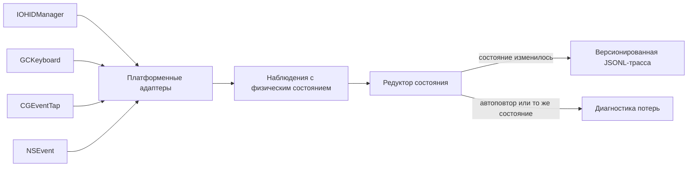

# Физические состояния клавиш

Этот Swift-прототип выбирает стек наблюдения клавиатуры для требования о [физических переходах клавиш](../../Требования/🚧-физические-переходы-клавиш.md) и реализует клавиатурный срез [версионированной первичной трассы событий ввода](../../Требования/🚧-версионированная-первичная-трасса-событий-ввода.md). Гибридная архитектура использует `IOHIDManager` как первичный macOS-источник, `GCKeyboard` как переносимый слой платформ Apple, а `CGEventTap` и `NSEvent` как диагностические источники для измерения потерь и поведения системного потока.

Графический проводник `FUMInputGuide` превращает план физической приёмки в управляемый локальный сеанс. Он объясняет назначение и границы сбора, требует явного согласия, запускает выбранные источники, последовательно показывает карточки сценариев, включает запись только внутри активной карточки и сохраняет локальный набор данных прямо в рабочей копии репозитория. Между карточками события не записываются; неожиданная клавиша аннулирует попытку, но её код в файл не попадает.

Первичная трасса содержит только изменения явного физического состояния клавиши. Автоповтор не считается физическим событием: источник с явным признаком повтора отбрасывается сразу, а общий редуктор независимо исключает повтор уже известного состояния.

## Проверяемый контракт



Ключ задаётся пространством кодов, идентификатором устройства, usage page и usage. Для HID-источника это настоящий HID usage; виртуальный код `CGEvent` и `NSEvent` хранится в отдельном пространстве `macVirtualKeyCode` и не выдаётся за HID usage. Состояния `pressed` и `released` не выводятся из символа, раскладки, общего флага модификаторов или логического режима Caps Lock.

Все адаптеры приводят временные метки к единой монотонной шкале наносекунд с момента запуска системы через `MonotonicTimestampNormalizer`. IOHID передаёт тики AbsoluteTime, которые преобразуются с коэффициентом `mach_timebase_info`; `CGEvent` и `GCKeyboard` явно передают уже наносекундные значения, а секунды `NSEvent` проверяются и переводятся в наносекунды. Преобразование IOHID не переполняет промежуточное произведение и отклоняет непредставимый итог вместо аварии или незаметного искажения.

Фильтрация выполняется в два слоя:

1. наблюдение с `isAutoRepeat == true` отклоняется как автоповтор;
2. наблюдение, равное уже известному состоянию той же клавиши того же устройства, отклоняется как неизменившееся состояние;
3. только оставшийся переход получает `schemaVersion`, последовательный номер, предыдущее состояние, новое состояние и монотонное время.

## Выбор стека

| Источник       | Физическое состояние                                                 | Идентичность устройства | Автоповтор                                  | Роль в выбранном стеке                    |
| -------------- | -------------------------------------------------------------------- | ----------------------- | ------------------------------------------- | ----------------------------------------- |
| `IOHIDManager` | значение HID-элемента и HID usage                                    | раздельная              | не нужен; дубликаты отсекает редуктор       | первичный источник клавиатуры на macOS    |
| `GCKeyboard`   | `pressed` в обработчике изменения и `GCKeyCode`                      | объединённая            | отдельного признака нет; состояние меняется | переносимый слой Apple и резерв на macOS  |
| `CGEventTap`   | `keyDown`/`keyUp`; для `flagsChanged` — запрос состояния HID-системы | отсутствует             | есть явное поле                             | системная диагностика и сравнение потерь  |
| `NSEvent`      | `keyDown`/`keyUp`; модификаторы приходят как `flagsChanged`          | отсутствует             | есть `isARepeat`                            | прикладная диагностика, не первичный слой |
| UI Presses     | HID usage и фазы на поддерживаемых UI-платформах                     | отсутствует             | зависит от платформенного контура           | будущий прикладной контрольный источник   |

`IOHIDManager` выигрывает на macOS не из-за заранее заданного веса API, а потому что единственный из реализованных кандидатов одновременно сохраняет HID usage, значение элемента, монотонное время и раздельную идентичность устройств. `GCKeyboard` выигрывает в переносимом срезе благодаря общему публичному API Apple и явному булеву состоянию, но его `coalesced`-модель фиксируется как потеря различимости нескольких клавиатур.

## Состав прототипа

- `FUMInputCore` — переносимая модель ключа, наблюдения, перехода, JSONL-записи, редуктор состояния и воспроизводимая матрица кандидатов;
- `FUMInputMac` — адаптеры `IOHIDManager`, `GCKeyboard`, `CGEventTap` и `NSEvent`, инвентаризация HID-клавиатур и снимок доступности среды;
- `FUMInputGuide` — нативный SwiftUI-проводник согласия, выбора источников, сценариев физической приёмки, локального хранения, просмотра и удаления результата;
- `FUMInputProbe` — headless-команды для вывода матрицы, проверки среды, инвентаризации устройств и явно включаемой записи;
- `FUMInputCoreTests` и `FUMInputMacTests` — автономные тесты физического контракта и преобразования платформенных событий.

План проводника версии `1` содержит обязательные и условные сценарии: обычный цикл и перекрытие двух клавиш, долгое удержание с автоповтором, стороны всех модификаторов, одновременные Command, комбинацию Shift + A, два цикла Caps Lock, одинаковую физическую клавишу в двух раскладках, Fn или Globe с верхним рядом, границу медиа-клавиши, потерю фокуса, вторую клавиатуру, отключение и подключение, сон и пробуждение, отзыв разрешения и плотный поток под нагрузкой. Аппаратно недоступный или ненаблюдаемый сценарий остаётся в манифесте со статусом `unsupported`, а не исчезает и не подменяется синтетическим переходом.

## Как проверить

Сборка и автономные тесты не требуют сети, секретов, разрешения на запись пользовательского ввода или фактического нажатия клавиш:

```bash
swift test --package-path Прототипы/физические-состояния-клавиш
swift build \
  --package-path Прототипы/физические-состояния-клавиш \
  --product FUMInputProbe
swift format lint \
  --configuration Инструменты/fum-kompleksnaya-proverka-repozitoriya/swift-format.json \
  --strict \
  --recursive \
  Прототипы/физические-состояния-клавиш/Sources \
  Прототипы/физические-состояния-клавиш/Tests \
  Прототипы/физические-состояния-клавиш/Package.swift
```

Общий [smoke-check репозитория](../../Инструменты/fum-kompleksnaya-proverka-repozitoriya/SKILL.md) автоматически выполняет эти автономные тесты, отдельно собирает `FUMInputProbe` и применяет строгий `swift format lint --strict` ко всем путям целей и `Package.swift`.

Простой запуск без аргументов открывает графический проводник. Само открытие окна не запускает источники и не создаёт содержательных записей:

```bash
./Прототипы/физические-состояния-клавиш/запустить.sh
```

Воспроизводимая матрица и предварительная рекомендация остаются доступны отдельной безопасной командой:

```bash
./Прототипы/физические-состояния-клавиш/запустить.sh matrix
```

Проверка доступности API и публикационно чистая инвентаризация без серийных номеров и локальных путей:

```bash
./Прототипы/физические-состояния-клавиш/запустить.sh environment
./Прототипы/физические-состояния-клавиш/запустить.sh devices
```

Запись запускается только отдельной явной командой. Она ничего не сохраняет сама, а выводит JSONL в stdout; перенаправление в файл является отдельным решением оператора:

```bash
./Прототипы/физические-состояния-клавиш/запустить.sh record \
  --source iohid-manager \
  --seconds 30
```

Скрипт сам определяет путь к Swift-пакету и работает из любого текущего каталога. Доступны также `gc-keyboard`, `cg-event-tap` и `ns-event`. Последние два требуют разрешения macOS Input Monitoring. Успешный запуск CLI не означает согласия на долговременное хранение или передачу трассы.

## Локальные данные проводника

`запустить.sh` вычисляет корень текущей рабочей копии относительно собственного расположения и передаёт его процессу `FUMInputGuide` только через runtime-переменную `FUM_REPOSITORY_ROOT`. Проводник принимает лишь абсолютное значение, канонизирует переданный корень с разрешением его символьных компонентов и подтверждает результат по одновременному наличию `AGENTS.md`, `.git` и точного `Прототипы/физические-состояния-клавиш/Package.swift`. При прямом запуске собранного бинарника переменную нужно задать явно; её отсутствие, относительное значение или несовпадение маркеров закрывает запись. Поэтому перенесённый бинарник не знает прежний checkout и может работать с новым явно переданным корнем. Актуальный абсолютный путь показывается человеку, но не сериализуется в данные.

Завершённый сеанс хранится в:

```text
Прототипы/физические-состояния-клавиш/Локальные-данные-прогонов/session-<время-MSK>-<идентификатор>/
├── manifest.json
└── events.jsonl
```

`manifest.json` содержит версию формата, точный снимок плана, выбранные и фактически доступные источники и исход каждой попытки. `events.jsonl` содержит только разрешённые текущей карточкой физические коды, фазы, источник, монотонное время, именованные диагностические флаги, результат отдельного для каждого источника редуктора и разрывы `CGEventTap`. Символы, введённый текст, название раскладки, приложение переднего плана, имя пользователя, имя машины, серийный номер и абсолютный путь не сохраняются.

Незавершённый сеанс сначала живёт в каталоге `.incomplete-*`; события пишутся туда сразу во время активной карточки. Штатная отмена или закрытие единственного окна останавливает источники и удаляет этот каталог, но после аварийного завершения он может остаться для ручного разбора. После синхронизации файлов и атомарной записи манифеста весь каталог переименовывается в окончательное имя без перезаписи существующего результата. Каталог получает права `0700`, файлы — `0600`. Точный путь базово исключён из Git через корневой `.gitignore`: данные находятся прямо в рабочей копии и доступны локальному анализу, но не попадут в публичный CC0-репозиторий случайным `git add`. Явная кнопка GUI удаляет завершённый сеанс после подтверждения.

Базовое исключение защищает от случайной публикации, но не разрешает отделять существенный вывод от исходных свидетельств. Если завершённый сеанс становится основанием для вывода, влияющего на требования, выбор стека, архитектуру, статус или приёмку, публикационно проверенный каталог именно этого сеанса с `manifest.json` и `events.jsonl` добавляется в тот же коммит точным обходом исключения:

```bash
git add -f -- \
  "Прототипы/физические-состояния-клавиш/Локальные-данные-прогонов/session-<время-MSK>-<идентификатор>/"
```

Материал с выводом должен ссылаться на этот каталог. Весь каталог `Локальные-данные-прогонов/`, незавершённые `.incomplete-*` и сеансы, не прошедшие публикационную проверку, принудительно не добавляются. Если исходный сеанс нельзя опубликовать, существенный вывод откладывается до публикационно чистого воспроизводимого прогона.

## Проверенный результат

Тесты управляемого сбора сначала были запущены в красном состоянии при отсутствующих плане, хранилище и поиске репозитория. Реализация доведена до прохождения 38 автономных тестов. Они проверяют:

- отдельные нажатие и отпускание;
- исключение помеченного автоповтора;
- исключение повторного состояния без признака автоповтора;
- независимые состояния левой и правой Command;
- независимые состояния одинаковых клавиш разных устройств;
- отклонение наблюдения без явного физического состояния;
- версионированное кодирование и чтение трассы без поля автоповтора;
- преобразование HID usage и значений;
- преобразование `CGEvent`, включая явный признак автоповтора;
- получение состояния `flagsChanged` из таблицы физического состояния, а не из флагов;
- преобразование тиков Mach с коэффициентом, отличным от `1/1`, без переполнения промежуточного произведения;
- безопасное отклонение непредставимой временной метки и недопустимых секунд;
- сведение временных доменов IOHID, CGEvent, NSEvent и GCKeyboard к одинаковому наносекундному значению;
- воспроизводимый выбор `IOHIDManager` для macOS и `GCKeyboard` для переносимого слоя;
- полноту и уникальность сценарного плана версии `1`;
- отдельный редуктор для каждого одновременно работающего источника;
- упорядоченную доставку всех уже принятых callback до закрытия границы сценария;
- сохранение автоповтора как диагностически отклонённого сырого наблюдения;
- отказ от сохранения неожиданной клавиши при видимом счётчике нарушения;
- запрет ложного `completed` для нулевого, частичного, несбалансированного, слишком короткого, неверно упорядоченного или недостаточного свидетельства и запрет сохранения сеанса с неклассифицированными карточками;
- атомарное завершение сеанса, JSONL-кодирование, отсутствие абсолютного пути и права `0700`/`0600`;
- fail-closed-проверку абсолютного runtime-корня из `FUM_REPOSITORY_ROOT`, обязательных маркеров, переноса checkout и отклонения символьной ссылки каталога записи;
- matching top-level-интерфейсов Keyboard и Consumer Control и сохранение выбранных consumer usage медиа-клавиш через `IOHIDManager`;
- диагностические вид события и именованные флаги `CGEvent`, включая `secondaryFn`.

На текущем стенде macOS 27.0 с Xcode 27.0 пробник обнаружил одну HID-клавиатуру с 271 клавиатурным элементом, подтвердил доступ пассивного `CGEventTap` и показал отсутствие доступного `GCKeyboard.coalesced` в headless-процессе. Содержательные события клавиатуры в этой приёмке не записывались: пользователь не давал отдельного согласия на захват фактических нажатий.

## План реализации

### Этап 1 — завершённый каркас

Переносимое Swift-ядро, четыре macOS-адаптера, двухслойная фильтрация автоповтора, версия схемы, headless-пробник и автономные тесты уже реализованы. Карточки физических переходов клавиш и общего каркаса трассы имеют статус `🚧`.

### Этап 2 — проводник готов, физическая матрица ожидает прогона

Графический проводник, локальный формат данных и автономные проверки готовы. Нужен отдельный явно включённый прогон на реальных устройствах: провести карточки через доступные источники, повторить раскладочный сценарий двумя попытками, отдельно пройти условные сценарии на внешней клавиатуре и зафиксировать `unsupported` там, где API не наблюдает Fn, consumer-клавишу или жизненный цикл. Первичная трасса должна содержать только физические изменения, а автоповтор и разрывы — диагностический слой.

### Этап 3 — переносимый стенд Apple

Следующий пакет должен добавить минимальные приложения-оболочки для iOS, iPadOS, tvOS и visionOS. В них сравниваются `GCKeyboard` и платформенные UI Presses на одной схеме, проверяются доступность внешней клавиатуры, HID usage, стороны модификаторов, Caps Lock, область фокуса и ограничения фонового режима.

### Этап 4 — долговременная трасса

После физических измерений [общий контракт трассы](../../Требования/🚧-версионированная-первичная-трасса-событий-ввода.md) расширяется событиями подключения, отключения, конфигурации, разрыва и переполнения. Хранилище получает атомарную дозапись, версию адаптера и API, а [защищённый сбор чувствительного ввода](../../Требования/🟡-защищённый-сбор-чувствительного-ввода.md) — политику срока хранения, защиту клавиатурного потока и проверяемое удаление. Диагностика остаётся отделена от первичных переходов.

### Этап 5 — интеграция

Подтверждённые адаптеры подключаются к сервисному слою коробочной FUM. Интерпретация клавиш, жесты и команды строятся как производные потребители неизменяемой трассы и не меняют наблюдаемый физический слой.

## Ограничения

- Реальные фазы Caps Lock и всех модификаторов ещё не проверены на физической клавиатуре через каждый источник.
- `NSEvent` объединяет локальный и глобальный мониторы, чтобы окно проводника не создавало слепую зону; это всё равно прикладной источник с общей идентичностью сеанса, а не замена `IOHIDManager`.
- `CGEventTap` сообщает отключение по тайм-ауту или пользовательскому вводу и повторно включается в общем run-loop mode, но текущий сеанс ещё не сбрасывает состояние редуктора на такой границе; физический прогон должен считать её диагностическим разрывом.
- Карточка медиа-клавиши разрешает HID Consumer usages Volume Increment и Play/Pause через `IOHIDManager`, который подключает top-level-интерфейсы Keyboard и Consumer Control; `CGEventTap`, `NSEvent` и `GCKeyboard` могут их не сообщить. Другие consumer-клавиши пока не входят в allowlist, а ненаблюдаемая аппаратная граница фиксируется как `unsupported`.
- `IOHIDManager` реализован для клавиатурной usage page и двух выбранных Consumer usages; мышь, контактные поверхности и перьевые устройства выделены в самостоятельные карточки и требуют собственных адаптеров.
- Идентификатор HID-устройства сейчас устойчив только внутри одного запуска и намеренно не строится из серийного номера; долговременная публикационно чистая идентичность требует отдельного контракта.
- `GCKeyboard.coalesced` не сохраняет идентичность нескольких физических клавиатур, а его метка фиксирует время обработки callback, а не предоставленное API время возникновения события.
- `CGEventTap` и `NSEvent` используют виртуальные коды и общее состояние сеанса, поэтому не могут заменить HID-источник.
- Непредставимая временная метка безопасно отклоняется, но отдельный диагностический счётчик такой потери ещё не реализован.
- Единица временных меток нормализована, но фактические смещения, дрейф и поведение часов разных API во время сна и пробуждения ещё не проверены физической серией.
- Запуск через `swift run` не даёт устойчивой подписанной идентичности приложения для TCC. Для повторяемой приёмки разрешений понадобится отдельная `.app`-оболочка; текущий GUI лишь запрашивает и показывает состояние системного доступа.
- Корень репозитория принимается только из runtime-переменной `FUM_REPOSITORY_ROOT`; launcher вычисляет её для текущего checkout, а прямой запуск обязан передать её явно. Автоматический поиск другого каталога намеренно отсутствует.
- Локальные Debug-продукты Swift могут содержать путь сборочной машины в отладочных и линковочных метаданных, хотя locator больше не использует такой путь во время исполнения. Каталог `.build` исключён из Git и не является публикуемым бинарным артефактом; будущая поставка бинарника потребует отдельной Release-сборки с преобразованием или удалением путей и побайтовой публикационной проверкой.
- Точные монотонные времена и последовательность физических кодов остаются чувствительными локальными данными даже без символов. Автоматического срока удаления и экспорта нет: человек удаляет сеанс явно, а любая публикация требует отдельной проверки.
- Пакет пока ориентирован на macOS; переносимое ядро не равно собранным приложениям для остальных платформ Apple.
- Прототип не создаёт синтетический ввод, не обходит системную защиту и не обещает доступ к аппаратным отчётам, которые ОС не предоставляет.

## Статус

Статус: действующий исследовательский прототип, готовый графический проводник физической macOS-приёмки и принятый предварительный выбор клавиатурного стека. Автоматические проверки проходят, но фактический набор пользовательских событий ещё не собран; завершение требования о физических переходах клавиш зависит от явно разрешённых физических прогонов и переносимых приложений-стендов.

## Источники требований

- [исходный запрос 2026-07-22 13:39:29 MSK - Устранить машинно-локальные пути](../../Журнал/2026-07-22_13-39-29_MSK_устранить-машинно-локальные-пути/запрос.md)
- [исходный запрос 2026-07-21 15:33:02 MSK - Добавлять доказательные данные прогонов клавиш](../../Журнал/2026-07-21_15-33-02_MSK_добавлять-доказательные-данные-прогонов-клавиш/запрос.md)
- [исходный запрос 2026-07-21 13:49:43 MSK - Доработать прототип сбора клавиатурных событий](../../Журнал/2026-07-21_13-49-43_MSK_доработать-прототип-сбора-клавиатурных-событий/запрос.md)
- [исходный запрос 2026-07-17 10:40:21 MSK - Создать прототип физических состояний клавиш](../../Журнал/2026-07-17_10-40-21_MSK_создать-прототип-физических-состояний-клавиш/запрос.md)
- [исходный запрос 2026-07-17 10:07:09 MSK - Различать фазы модификаторов и Caps Lock](../../Журнал/2026-07-17_10-07-09_MSK_различать-фазы-модификаторов-и-Caps-Lock/запрос.md)
- [исходный запрос 2026-07-17 09:41:27 MSK - Уточнить различение нажатия и отпускания Caps Lock](../../Журнал/2026-07-17_09-41-27_MSK_уточнить-различение-нажатия-и-отпускания-Caps-Lock/запрос.md)
- [исходный запрос 2026-07-17 09:18:01 MSK - Добавить карточку сырой записи событий ввода](../../Журнал/2026-07-17_09-18-01_MSK_добавить-карточку-сырой-записи-событий-ввода/запрос.md)
- [исходный запрос 2026-07-17 12:20:17 MSK - Создать скрипты запуска прототипов](../../Журнал/2026-07-17_12-20-17_MSK_создать-скрипты-запуска-прототипов/запрос.md)
- [исходный запрос 2026-07-18 07:11:37 MSK - Декомпозировать карточку устройств ввода](../../Журнал/2026-07-18_07-11-37_MSK_декомпозировать-карточку-устройств-ввода/запрос.md)
- [исходный запрос 2026-07-20 14:24:31 MSK - Нормализовать монотонное время источников ввода](../../Журнал/2026-07-20_14-24-31_MSK_нормализовать-монотонное-время-источников-ввода/запрос.md)

## Опорные материалы

- [`GCKeyboard`](https://developer.apple.com/documentation/gamecontroller/gckeyboard)
- [`GCKeyboardValueChangedHandler`](https://developer.apple.com/documentation/gamecontroller/gckeyboardvaluechangedhandler)
- [`CGEvent`](https://developer.apple.com/documentation/coregraphics/cgevent)
- [`CGEventField.keyboardEventAutorepeat`](https://developer.apple.com/documentation/coregraphics/cgeventfield/keyboardeventautorepeat)
- [`CGEventSource.keyState`](https://developer.apple.com/documentation/coregraphics/cgeventsource/keystate%28_%3Akey%3A%29)
- [`NSEvent`](https://developer.apple.com/documentation/appkit/nsevent)
- [`IOHIDManagerRegisterInputValueCallback`](https://developer.apple.com/documentation/iokit/1438367-iohidmanagerregisterinputvalueca)

<!-- FUM-MD-RECENCY:BEGIN -->
<!-- last-content-edit: 2026-08-03 14:54:04 MSK -->
<!-- content-sha256: sha256:fbbddb47f1df758585b5b713e03dd25b5c0cf0e9ec06ca14bd4be8d7de30634e -->
<!-- FUM-MD-RECENCY:END -->
