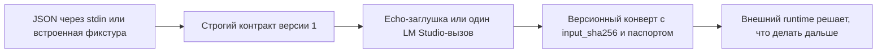

# Чистый модельный шаг

Этот Swift-прототип проверяет [контракт чистого модельного шага](../../Документация/41-контракт-чистого-модельного-шага.md) на детерминированной заглушке `fum.deterministic-echo.v1` и реальном однократном адаптере `fum.lm-studio-cli.one-shot.v1`. Один JSON-запрос передаёт полный текстовый контекст, ожидаемую идентичность провайдера, лимиты и явный запрет эффектных возможностей; один версионный конверт возвращает инертный текст или типизированный непринятый исход.

Адаптер не запускает [агентский цикл](../../Глоссарий/агентский-цикл.md) и не имитирует качество модели. Он проверяет более узкую границу: модельный вывод можно получить одним локальным process-вызовом, связать с точным входом и передать внешнему runtime, не давая модели инструментов, файлов, сети или права исполнять этот вывод.

## Проверяемый контур



Ядро требует точные поля конверта и отклоняет неизвестные. `capabilities.tools`, `capabilities.files` и `capabilities.network` принимаются только со значением `false`. Идентичность провайдера сверяется до вызова. Shell-подобные строки остаются обычными байтами Swift `String` и не передаются shell или subprocess.

## Как запустить

Без аргументов точка входа выполняет безопасную встроенную фикстуру:

```bash
./Прототипы/чистый-модельный-шаг/запустить.sh
```

Явный повтор той же фикстуры:

```bash
./Прототипы/чистый-модельный-шаг/запустить.sh fixture
```

Передать собственный конверт через stdin:

```bash
printf '%s\n' '<JSON-конверт-версии-1>' | \
  ./Прототипы/чистый-модельный-шаг/запустить.sh stdin
```

Пробник читает не более `1048577` байт: один байт сверх предела нужен только для наблюдаемого отказа. Завершение stdin обеспечивает вызывающий процесс; `limits.timeout_milliseconds` исполняется real-provider process-runner.

## Реальный provider-профиль

`LMStudioModelOnlyAdapter` требует явную конфигурацию: точный путь уже установленного `lms`, точный ключ уже сохранённой модели, наблюдаемые версии CLI и приложения и минимальный allowlist среды. Без неё результат имеет код `provider_unconfigured`; echo-заглушка автоматически не подставляется.

Адаптер передаёт всю последовательность сообщений как JSON-фрейм, запускает `lms chat` напрямую без shell, использует `--prompt`, `--dont-fetch-catalog`, `-y` и короткий TTL. В паспорте sampling, seed, предел токенов и хэш весов записаны как `unknown`, потому что текущий CLI их не раскрывает и не позволяет задать в этом режиме. Prompt проходит через argv, поэтому профиль ограничен `65536` байтами, не принимает U+0000 и не предназначен для чувствительного произвольного контекста.

Живой интеграционный XCTest включается только четырьмя полями паспорта и отдельным флагом:

```bash
FUM_RUN_LIVE_MODEL_TEST=1 \
FUM_LM_STUDIO_EXECUTABLE='<путь-к-уже-установленному-lms>' \
FUM_LM_STUDIO_MODEL='<точный-ключ-уже-сохранённой-модели>' \
FUM_LM_STUDIO_RUNTIME='<наблюдаемая-версия-lms>' \
FUM_LM_STUDIO_APPLICATION='<наблюдаемая-версия-LM-Studio>' \
swift test --package-path Прототипы/чистый-модельный-шаг \
  --filter LMStudioModelOnlyAdapterTests/testLiveLMStudioOneShotWhenExplicitlyConfigured
```

Команда не скачивает модель и не обращается к каталогу. Обычный `swift test` использует записанные исходы, запускает только безопасные системные процессы для проверки границ и пропускает живой тест.

Получить справку:

```bash
./Прототипы/чистый-модельный-шаг/запустить.sh --help
```

## Проверки

```bash
swift test --package-path Прототипы/чистый-модельный-шаг
swift build \
  --package-path Прототипы/чистый-модельный-шаг \
  --product FUMModelStepProbe
swift format lint \
  --configuration Инструменты/fum-kompleksnaya-proverka-repozitoriya/swift-format.json \
  --strict \
  --recursive \
  Прототипы/чистый-модельный-шаг/Package.swift \
  Прототипы/чистый-модельный-шаг/Sources \
  Прототипы/чистый-модельный-шаг/Tests
```

Автономный набор проверяет успешный UTF-8-вызов, каноническую повторяемость, привязку `input_sha256`, строгие поля, запрет эффектных capabilities, обязательное сообщение `user`, ровно допустимый байтовый предел, лишний байт, тайм-аут, отмену, отказ, ошибку, недоступность и ненастроенность без раскрытия диагностики.

## Структура

- `Sources/FUMPureModelStep/` — типы конверта, строгий декодер, кодировщики, детерминированный провайдер и LM Studio process-adapter;
- `Sources/FUMModelStepProbe/` — безопасная встроенная фикстура и режим чтения stdin;
- `Tests/FUMPureModelStepTests/` — автономные записанные проверки и отдельный opt-in live-тест;
- `Package.swift` — самостоятельный пакет без внешних SwiftPM-зависимостей;
- `запустить.sh` — общая POSIX-точка входа прототипа.

## Граница применимости

Результат доказывает контракт, заглушку, process-level timeout/cancel/output-limit и один живой вызов локальной LLM, но не качество или детерминизм модели, пригодность любого оборудования, безопасность будущих действий, вложение циклов либо наличие полного собственного runtime FUM.

[Теневой редактор продолжений](../теневой-редактор-продолжений/README.md) уже подтверждает часть локального Ollama-профиля, но не объявлен совместимым с общим контрактом до полной фиксации runtime, весов и параметров генерации. `Codex CLI` не принимается как model-only-провайдер без отдельного доказанного режима, исключающего его собственный агентский цикл и инструменты.

Статус: действующий проверочный прототип. Пакет собирается, автономные тесты проходят, встроенная фикстура даёт воспроизводимый результат, а opt-in-профиль LM Studio выполняет один реальный model-only-вызов при явной конфигурации.

## Источники требований

- [исходный запрос текущей рабочей сессии](../../Запросы/2026-07-23_18-12-05_MSK_проверить-контракт-чистого-модельного-шага-для-исполняемого-агентского-цикла.md)
- [исходный запрос о подключении реального model-only-адаптера](../../Запросы/2026-07-29_23-53-42_MSK_подключить-проверяемый-реальный-model-only-адаптер.md)
- [MVP-кандидат исполняемого агентского цикла](../../Планирование/MVP-кандидаты/04-исполняемый-агентский-цикл/README.md)
- [карточка FUM-STEP-0005](../../Планирование/карточки-шагов/✅-FUM-STEP-0005-проверить-контракт-чистого-модельного-шага-для-исполняемого-агентского-цикла.md)

## Опорные материалы

- [минимальный формат трассы исполняемого агентского цикла](../../Документация/37-минимальный-формат-трассы-исполняемого-агентского-цикла.md)
- [частично прояснённый вопрос о развилке гиперсети и агентского цикла FUM](../../Вопросы/2026-07-03_15-36-48_MSK_развилка-гиперсети-и-агентского-цикла-FUM.md)
- [теневой редактор продолжений](../теневой-редактор-продолжений/README.md)

<!-- FUM-MD-RECENCY:BEGIN -->
<!-- last-content-edit: 2026-07-30 07:01:38 MSK -->
<!-- content-sha256: sha256:8417bc33b3dc4a389e9e45024f60d266a807b7c55ce54238b76ad142520d774c -->
<!-- FUM-MD-RECENCY:END -->
