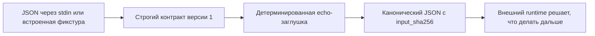

# Чистый модельный шаг

Этот Swift-прототип проверяет [контракт чистого модельного шага](../../Документация/41-контракт-чистого-модельного-шага.md) на детерминированной заглушке `fum.deterministic-echo.v1`. Один JSON-запрос передаёт полный текстовый контекст, ожидаемую идентичность провайдера, лимиты и явный запрет эффектных возможностей; один канонический JSON-ответ возвращает последнее сообщение `user` как инертный текст.

Прототип не является LLM, не запускает [агентский цикл](../../Глоссарий/агентский-цикл.md) и не имитирует качество модели. Он проверяет более узкую границу: модельный вывод можно получить, связать с точным входом и передать внешнему runtime, не давая провайдеру инструментов, файлов, сети или права исполнять этот вывод.

## Проверяемый контур



Ядро требует точные поля конверта и отклоняет неизвестные. `capabilities.tools`, `capabilities.files` и `capabilities.network` принимаются только со значением `false`. Идентичность провайдера сверяется до вызова. Shell-подобные строки остаются обычными байтами Swift `String` и не передаются shell или subprocess.

## Как запустить

Без аргументов точка входа выполняет безопасную встроенную фикстуру:

```bash
./Прототипы/чистый-модельный-шаг/запустить.sh
```

Явный повтор той же фикстуры:

```bash
./Прототипы/чистый-модельный-шаг/запустить.sh fixture
```

Передать собственный конверт через stdin:

```bash
printf '%s\n' '<JSON-конверт-версии-1>' | \
  ./Прототипы/чистый-модельный-шаг/запустить.sh stdin
```

Пробник читает не более `1048577` байт: один байт сверх предела нужен только для наблюдаемого отказа. Завершение stdin и транспортный тайм-аут обеспечивает вызывающий процесс; `limits.timeout_milliseconds` относится к будущему вызову реального провайдера, а не к ожиданию входного потока.

Получить справку:

```bash
./Прототипы/чистый-модельный-шаг/запустить.sh --help
```

## Проверки

```bash
swift test --package-path Прототипы/чистый-модельный-шаг
swift build \
  --package-path Прототипы/чистый-модельный-шаг \
  --product FUMModelStepProbe
swift format lint \
  --configuration Инструменты/fum-kompleksnaya-proverka-repozitoriya/swift-format.json \
  --strict \
  --recursive \
  Прототипы/чистый-модельный-шаг/Package.swift \
  Прототипы/чистый-модельный-шаг/Sources \
  Прототипы/чистый-модельный-шаг/Tests
```

Автономный набор проверяет успешный UTF-8-вызов, каноническую повторяемость, привязку `input_sha256`, строгие поля, запрет эффектных capabilities, обязательное сообщение `user`, предел выхода, стабильные коды ошибок и инертность shell-метасимволов.

## Структура

- `Sources/FUMPureModelStep/` — типы конверта, строгий декодер, канонический кодировщик и детерминированный провайдер;
- `Sources/FUMModelStepProbe/` — безопасная встроенная фикстура и режим чтения stdin;
- `Tests/FUMPureModelStepTests/` — автономные проверки без сети, секретов, модели и внешнего сервиса;
- `Package.swift` — самостоятельный пакет без внешних SwiftPM-зависимостей;
- `запустить.sh` — общая POSIX-точка входа прототипа.

## Граница применимости

Результат доказывает контракт и реализацию заглушки, но не качество или детерминизм реальной LLM, пригодность локального оборудования, безопасность будущих действий, вложение циклов либо наличие собственного runtime FUM. Предел времени записан во входе, но мгновенная заглушка не доказывает отмену зависшего process-adapter; это отдельная conformance-проверка реального провайдера.

[Теневой редактор продолжений](../теневой-редактор-продолжений/README.md) уже подтверждает часть локального Ollama-профиля, но не объявлен совместимым с общим контрактом до полной фиксации runtime, весов и параметров генерации. `Codex CLI` не принимается как model-only-провайдер без отдельного доказанного режима, исключающего его собственный агентский цикл и инструменты.

Статус: действующий проверочный прототип. Пакет собирается, автономные тесты проходят, встроенная фикстура даёт воспроизводимый результат. Реальный LLM-провайдер намеренно не подключён.

## Источники требований

- [исходный запрос текущей рабочей сессии](../../Запросы/2026-07-23_18-12-05_MSK_проверить-контракт-чистого-модельного-шага-для-исполняемого-агентского-цикла.md)
- [MVP-кандидат исполняемого агентского цикла](../../Планирование/MVP-кандидаты/04-исполняемый-агентский-цикл/README.md)
- [карточка FUM-STEP-0005](../../Планирование/карточки-шагов/✅-FUM-STEP-0005-проверить-контракт-чистого-модельного-шага-для-исполняемого-агентского-цикла.md)

## Опорные материалы

- [минимальный формат трассы исполняемого агентского цикла](../../Документация/37-минимальный-формат-трассы-исполняемого-агентского-цикла.md)
- [частично прояснённый вопрос о развилке гиперсети и агентского цикла FUM](../../Вопросы/2026-07-03_15-36-48_MSK_развилка-гиперсети-и-агентского-цикла-FUM.md)
- [теневой редактор продолжений](../теневой-редактор-продолжений/README.md)

<!-- FUM-MD-RECENCY:BEGIN -->
<!-- last-content-edit: 2026-07-23 18:44:13 MSK -->
<!-- content-sha256: sha256:863af274c120b5a5c1259ede311c5adbfb00049f16568afd33a7ba795efebf73 -->
<!-- FUM-MD-RECENCY:END -->
