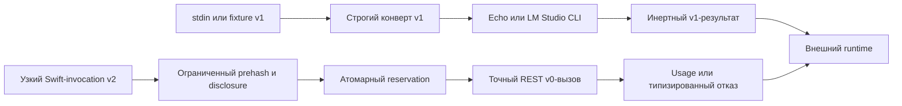

# Чистый модельный шаг

Этот Swift-прототип проверяет [контракт чистого модельного шага](../../Документация/41-контракт-чистого-модельного-шага.md) на детерминированной заглушке `fum.deterministic-echo.v1`, совместимом process-adapter `fum.lm-studio-cli.one-shot.v1` и отдельном бюджетном профиле `fum.lm-studio-rest-v0.budgeted.v1`. Строгий конверт версии `1` сохраняет прежний переносимый интерфейс, а профиль версии `2` добавляет независимо заданные disclosure-границы, шестимерный бюджет, атомарный reservation, исполнимый `max_tokens` и доверенное provider usage.

Адаптер не запускает [агентский цикл](../../Глоссарий/агентский-цикл.md) и не имитирует качество модели. Он проверяет более узкую границу: модельный вывод можно получить одним локальным вызовом, связать с точным входом и бюджетом и передать внешнему runtime, не давая модели инструментов, файлов, собственной сети или права исполнять этот вывод.

## Проверяемый контур



Точка входа `FUMModelStepProbe` читает только конверт версии `1` и в обычном запуске использует `DeterministicEchoProvider`. Бюджетная форма версии `2` входит в библиотечный API и проверяется автономными и opt-in-тестами; CLI не выдаётся за её точку входа.

Ядро требует точные поля конверта и отклоняет неизвестные. `capabilities.tools`, `capabilities.files` и `capabilities.network` принимаются только со значением `false`. Статическая identity настроенного provider/interface сверяется до вызова; фактические model/runtime REST-профиля доступны в ответе и проверяются после отправки синтетического prompt на уже разрешённый loopback endpoint. Shell-подобные строки остаются обычными байтами Swift `String` и не передаются shell или subprocess.

## Как запустить

Без аргументов точка входа выполняет безопасную встроенную фикстуру:

```bash
./Прототипы/чистый-модельный-шаг/запустить.sh
```

Явный повтор той же фикстуры:

```bash
./Прототипы/чистый-модельный-шаг/запустить.sh fixture
```

Передать собственный конверт через stdin:

```bash
printf '%s\n' '<JSON-конверт-версии-1>' | \
  ./Прототипы/чистый-модельный-шаг/запустить.sh stdin
```

Пробник читает не более `1048577` байт: один байт сверх предела нужен только для наблюдаемого отказа. Завершение stdin обеспечивает вызывающий процесс; `limits.timeout_milliseconds` исполняется real-provider process-runner.

## Совместимый CLI-профиль

`LMStudioModelOnlyAdapter` требует явную конфигурацию: точный путь уже установленного `lms`, точный ключ уже сохранённой модели, наблюдаемые версии CLI и приложения и минимальный allowlist среды. Без неё результат имеет код `provider_unconfigured`; echo-заглушка автоматически не подставляется.

Адаптер передаёт всю последовательность сообщений как JSON-фрейм, запускает `lms chat` напрямую без shell, использует `--prompt`, `--dont-fetch-catalog`, `-y` и короткий TTL. В паспорте sampling, seed, предел токенов и хэш весов записаны как `unknown`, потому что текущий CLI их не раскрывает и не позволяет задать в этом режиме. Prompt проходит через argv, поэтому профиль ограничен `65536` байтами, не принимает U+0000 и не предназначен для чувствительного произвольного контекста.

Отсутствие исполнимого token limit в `lms chat` не маскируется байтовым ограничением. Поэтому CLI-профиль сохраняется для совместимости и process-level проверок, но не используется как бюджетный профиль версии `2`.

## Бюджетный REST v0-профиль

`BudgetedModelOnlyAdapter` требует полностью заданный `ModelOnlyBudgetProfile`: `local | remote`, provider/interface/endpoint, model/runtime/tokenizer identity, классы, байтовый объём и назначение раскрытия, общий ceiling и максимальный reservation следующего вызова по вызовам, входным и выходным токенам, wall-clock-времени, вычислительным единицам и денежным микроединицам. Строгий decoder отклоняет неизвестные поля профиля и вложенных authority-объектов. Класс и назначение данных объявляет вызывающий контур; адаптер не распознаёт секрет, ошибочно названный `synthetic`.

Профиль и результат попытки имеют версию `2`, а публичный `BudgetedModelOnlyInvocation` является отдельной узкой Swift-формой с одним `input` без собственного поля версии. Это не полное расширение конверта версии `1`: перенос `messages`, `response_format`, JSON Schema и всего паспорта остаётся будущей интеграцией. Поле `remote` сериализуется строго, но исполняемый adapter принимает только `local` и закрывает remote-профиль до tokenizer/provider; источник цены и remote-согласование не предоставлены.

`VolatileModelBudgetLedger` одной actor-операцией связывает request hash с полным reservation. Активные и терминальные записи принадлежат ledger, поэтому replay остаётся идемпотентным между экземплярами adapter, пока жив actor/process; `durability = process_memory` не выдаётся за межпроцессное хранилище. Для локального профиля `compute_unit = wall_clock_millisecond`, `money_unit = none`, оба денежных предела равны нулю. Общий deadline включает tokenizer и HTTP, а provider получает остаток минимума wall-clock- и compute-reservation.

До JSON/SHA профиль и invocation проходят абсолютные prehash-пределы: `4096` UTF-8-байтов на строку профиля, не более `16` классов и `64` назначений по `1024` байта, `max_input_bytes <= 1048576`, а также `1024` байта на invocation ID и назначение. Публичная exact-фикстура дополнительно сканирует не более `28` байт входа. Ранний отказ типизирован, имеет `request_sha256 = nil`, не создаёт terminal ledger entry и reservation и не меняет бюджет.

Публичный исполняемый initializer принимает только константную аттестацию FUM-STEP-0108 и конкретный `LMStudioRESTV0BudgetTransport`; внедрение protocol-заглушек в adapter и transport доступно пакету только для автономных тестов, а raw provider/HTTP API скрыт. Transport закрыт на точную последовательность компонентов loopback-пути `api`, `v0`, `chat`, `completions`, передаёт `max_tokens` только из профиля и разбирает model/runtime/usage отдельно от `message.content`. Ephemeral HTTP-сессия не использует ambient cookie, credentials, cache или proxy, не следует redirect, имеет абсолютный resource timeout и абсолютный верхний предел тела `1048576` байт; настройка может только уменьшить его. Только успешно согласованная попытка хранит SHA-256 точных байтов тела, полученных после обработки HTTP-передачи; любой post-provider отказ даёт типизированный исход без digest, transport partial отделён от общей категории invalid response для malformed/schema mismatch, а wire-overflow имеет собственный исход.

Предварительная токенизация должна быть `exact` и совпасть с `prompt_tokens`. Так как REST v0 не предоставляет отдельную tokenize-capability, доступный live-профиль ограничен публичной константной аттестацией одного синтетического входа `Return the single letter A.`: provider/interface и framing одного user-message, endpoint, `qwen/qwen3-0.6b`, runtime, точный SHA-256 и `14` входных токенов закреплены вместе. Другой профиль, input или model закрывается до provider; произвольное число нельзя передать через публичный initializer, универсальная токенизация произвольного контекста не заявляется.

Живой интеграционный XCTest включается только полным бюджетным паспортом и отдельным флагом. LM Studio server должен быть уже запущен, а точная модель — уже находиться на диске:

```bash
FUM_RUN_LIVE_MODEL_TEST=1 \
FUM_LM_STUDIO_ENDPOINT='http://127.0.0.1:1234/api/v0/chat/completions' \
FUM_LM_STUDIO_MODEL='qwen/qwen3-0.6b' \
FUM_LM_STUDIO_RUNTIME_NAME='llama.cpp-mac-arm64-apple-metal-advsimd' \
FUM_LM_STUDIO_RUNTIME_VERSION='2.27.1' \
FUM_LM_STUDIO_TOKENIZER_ID='lmstudio.rest-v0.qwen3-0.6b.prompt-attestation.v1' \
swift test --package-path Прототипы/чистый-модельный-шаг \
  --filter LMStudioModelOnlyAdapterTests/testLiveLMStudioBudgetedRESTV0WhenExplicitlyConfigured
```

Тест передаёт только закреплённый синтетический prompt, требует `max_tokens = 1`, сверяет model/runtime identity, `finish_reason = length`, `prompt_tokens = 14`, `completion_tokens = 1` и формат хэша тела ответа. Точное совпадение SHA-256 с полученными байтами тела проверяет автономная transport-фикстура. Тест не запускает server, не скачивает модель, не обращается к каталогу, не извлекает секреты и не использует платный доступ. Обычный `swift test` использует записанные исходы, запускает только безопасные системные процессы для проверки границ и пропускает живой тест.

Получить справку:

```bash
./Прототипы/чистый-модельный-шаг/запустить.sh --help
```

## Проверки

```bash
swift test --package-path Прототипы/чистый-модельный-шаг
swift build \
  --package-path Прототипы/чистый-модельный-шаг \
  --product FUMModelStepProbe
swift format lint \
  --configuration Инструменты/fum-kompleksnaya-proverka-repozitoriya/swift-format.json \
  --strict \
  --recursive \
  Прототипы/чистый-модельный-шаг/Package.swift \
  Прототипы/чистый-модельный-шаг/Sources \
  Прототипы/чистый-модельный-шаг/Tests
```

Автономный набор проверяет успешный UTF-8-вызов, каноническую повторяемость, привязку `input_sha256`, строгие поля, запрет эффектных capabilities, обязательное сообщение `user`, ровно допустимый байтовый предел, лишний байт, тайм-аут, отмену, отказ, ошибку, недоступность и ненастроенность без раскрытия диагностики. Бюджетные suites дополнительно проверяют строгий authority-профиль, disclosure до provider, affordability каждого измерения, общий deadline, конкурентные reservation, same-ID reentrancy, replay между adapter, точный REST payload, redirect-отказ, byte cap, SHA-256 тела, trusted usage, точную tokenization и terminal outcomes для timeout, transport partial, invalid response, missing, negative, wire overflow и inconsistent counters.

## Структура

- `Sources/FUMPureModelStep/` — типы конверта, строгий декодер, кодировщики, детерминированный провайдер, совместимый LM Studio process-adapter, бюджетный ledger и REST v0-transport;
- `Sources/FUMModelStepProbe/` — безопасная встроенная фикстура и режим чтения stdin;
- `Tests/FUMPureModelStepTests/` — автономные записанные проверки и отдельный opt-in live-тест;
- `Package.swift` — самостоятельный пакет без внешних SwiftPM-зависимостей;
- `запустить.sh` — общая POSIX-точка входа прототипа.

## Граница применимости

Результат доказывает контракт, заглушку, process-level timeout/cancel/output-limit, атомарный process-memory budget ledger, исполнимый provider token limit, структурированное usage и один живой вызов локальной LLM для одной точной токенизационной фикстуры. Он не доказывает универсальный tokenizer, полный конверт версии `2`, remote transport, качество или детерминизм модели, пригодность любого оборудования, безопасность будущих действий, долговечность после аварии процесса, вложение циклов либо наличие полного собственного runtime FUM.

[Теневой редактор продолжений](../теневой-редактор-продолжений/README.md) уже подтверждает часть локального Ollama-профиля, но не объявлен совместимым с общим контрактом до полной фиксации runtime, весов и параметров генерации. `Codex CLI` не принимается как model-only-провайдер без отдельного доказанного режима, исключающего его собственный агентский цикл и инструменты.

Статус: действующий проверочный прототип. Пакет собирается, автономные тесты проходят, встроенная фикстура даёт воспроизводимый результат, а opt-in-профиль LM Studio REST v0 выполняет один реальный ограниченный model-only-вызов при явной конфигурации.

## Источники требований

- [исходный запрос о закреплении исполнимого токен-бюджета](../../Журнал/2026-07-31_18-05-50_MSK_закрепить-исполнимый-токен-бюджет-model-only-профиля/запрос.md)
- [исходный запрос текущей рабочей сессии](../../Журнал/2026-07-23_18-12-05_MSK_проверить-контракт-чистого-модельного-шага-для-исполняемого-агентского-цикла/запрос.md)
- [исходный запрос о подключении реального model-only-адаптера](../../Журнал/2026-07-29_23-53-42_MSK_подключить-проверяемый-реальный-model-only-адаптер/запрос.md)
- [MVP-кандидат исполняемого агентского цикла](../../Планирование/MVP-кандидаты/04-исполняемый-агентский-цикл/README.md)
- [карточка FUM-STEP-0005](../../Планирование/карточки-шагов/✅-FUM-STEP-0005-проверить-контракт-чистого-модельного-шага-для-исполняемого-агентского-цикла.md)

## Опорные материалы

- [минимальный формат трассы исполняемого агентского цикла](../../Документация/37-минимальный-формат-трассы-исполняемого-агентского-цикла.md)
- [частично прояснённый вопрос о развилке гиперсети и агентского цикла FUM](../../Вопросы/2026-07-03_15-36-48_MSK_развилка-гиперсети-и-агентского-цикла-FUM.md)
- [теневой редактор продолжений](../теневой-редактор-продолжений/README.md)

<!-- FUM-MD-RECENCY:BEGIN -->
<!-- last-content-edit: 2026-08-03 14:54:04 MSK -->
<!-- content-sha256: sha256:f53b398a7c9821839fd5dcaddb35f6df7427234c16ed2cd055911b120b80914f -->
<!-- FUM-MD-RECENCY:END -->
